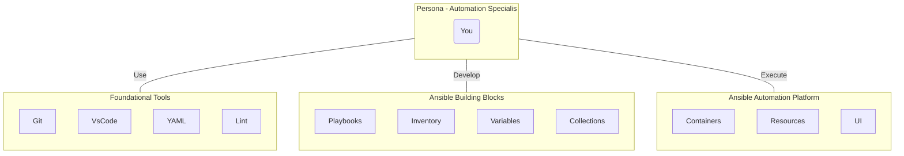

# Launch Adoption - AAP

Welcome! This repository serves as the entry point for our **Community of Practice (CoP) for Ansible Automation Platform (AAP) specialist enablement**.

## Our Mission: Increase "Speed to Capability Delivery"

This framework impacts our mission by providing a streamlined introduction to the *baseline stack* (Tools \-\> Ansible \-\> AAP), reducing the time required for new specialist enablement and accelerating their path to delivering automation.

> *The CoP maintains a versioned set of living documents that provide recommendations - it will take a commitment of time and effort to cultivate this repository specifically for a team. Notice the entry point is automation specialist (developer), not installation, infrastructure management, nor day-to-day administration of the AAP environment itself.*

## About our CoP for AAP Enablement

Our **domain**, **community**, and **practices**:

| About Our CoP | Description |
| :--- | :--- |
| [Why a CoP Focused on Enablement?](./about/aboutCoP.md) | Defines the CoP, its benefits, and links to automation maturity. |
| [Practice: Enablement Framework](./about/aboutPractice.md) | Explains our "Crawl, Walk, Run" model and session roadmap. |
| [Domain: Team Mission](./about/aboutDomain.md) | *To be defined in the CoP Kickoff Session.* |
| [Community: Team Profiles](./about/aboutCommunity.md) | *To be defined in the CoP Kickoff Session.* |

> Tip: [Formatting Files for this Repo](./about/aboutFormat.md)

## Our Enablement Framework

Our Enablement Framework aligns **Onboarding Topics** with **Adoption Sessions**.

### Onboarding Topics

The **Onboarding Topics** are grouped into focus areas in order to support a crawl, walk, run approach to AAP enablement.

| Topic | Focus Area |
| :--- | :--- |
| [Red Hat: Core Sites & Programs](./about/aboutRHResources.md) | :star: Key Red Hat resources (Customer Portal, Developer). |
| [Red Hat Enterprise Linux (RHEL)](./rhel/rhel.md) | Foundational RHEL skills (the "Control Plane" & "Target"). |
| [Foundational Tools](./foundation/foundation.md) | Core tools and concepts (Git, YAML, VSCode, IaC). |
| [Ansible Building Blocks](./ansible/ansible.md) | Core Ansible skills (Playbooks, Roles, Inventory). |
| [Containerization Essentials](./container/container.md) | Container skills (Podman, Buildah) for Execution Environments. |
| [Ansible Automation Platform (AAP)](./aap/aap.md) | The platform (Controller, Workflows, Hub) that runs it all. |

### Adoption Sessions

The **Adoption Sessions** provide the team with a roadmap to increase AAP Enablement. It is expected that the sessions are facilitated by a Red Hat Adoption Specialist Architect. The community (team) should agree upon a set of collaborative sessions to align the community and domain -- and keep a log of events.

Refer to our [Practice Framework](./about/aboutPractice.md) for a table of recommended MILESTONES to drive sessions.

## Use Cases

* [Use Case with RBAC with an MVP view](./usecase/rbac-mvp.md)
* [Use Case with RBAC deep dive into RACI](./usecase/rbac-raci.md)

---
> :link: *[This repo in web format](https://ppremru.github.io/LaunchAdoption-AAP/)*  
> :star: *Favorites*  
---
