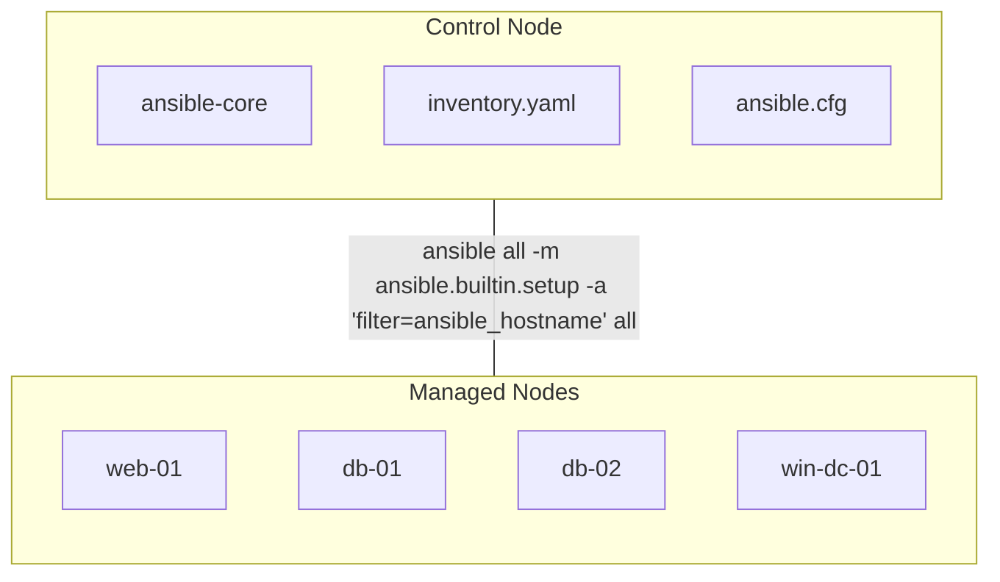

# Ansible 101: Sanity Check

This document outlines a "crawl-walk-run" path for developing foundational Ansible skills. The goal is not to provide a step-by-step lab, but to define the key concepts you should independently research and practice to become proficient with Ansible.

Use the [Ansible Community Documentation](https://docs.ansible.com/) and other references to explore each topic.

You can also use the free **[Ansible Basics: Automation Technical Overview (DO007)](https://www.redhat.com/en/services/training/do007-ansible-essentials-simplicity-automation-technical-overview)** lab as a hands-on resource.

## Your Enablement Milestones

Here is the high-level path from zero to a repeatable, maintainable automation workflow.

| Milestone | Name | Core Goal |
| :--- | :--- | :--- |
| 1 | Ad-Hoc | install, ansible (ad-hoc), inventory, config, module |
| 2 | Playbook | convert from ad-hoc command to an ansible playbook |
| 3 | Lint and Verbose | validate, lint, and debug playbook runs |
| 4 | Debug with Magic variables and gathered facts | use `debug` with 'magic' and gathered variables |
| 5 | Debug with Variables | define and use custom variables |

## 1. Ad-Hoc

### Core Competencies Checklist

| Core | Competency |
| :--- | :--- |
| Install | Install `sudo dnf install ansible-core` (linux) |
| CLI | Verify your installation `ansible --version` |
| Inventory | Build a static `inventory.yaml` file with your hosts |
| Config | Introduce an `ansible.cfg` file that points to your inventory |
| Run | Run an ad-hoc command to exec a module on the inventory with an argument `ansible all -m ansible.builtin.setup -a "filter=ansible_hostname"` |

> [Ansible Distros](https://docs.ansible.com/projects/ansible/latest/installation_guide/installation_distros.html)

### Environment



### `ansible.cfg`

```ini
[defaults]
inventory = inventory.yaml
remote_user = ansible
host_key_checking = False
```

### `inventory.yaml`

```inventory.yaml
---
web:
  hosts:
    web-01:
      ansible_host: 192.168.1.10

db:
  hosts:
    db-01:
      ansible_host: 192.168.1.11
    db-02:
      ansible_host: 192.168.1.12

dc:
  hosts:
    win-dc-01:
      ansible_host: 192.168.1.20
      # Settings required for Windows
      ansible_connection: winrm
      ansible_winrm_server_cert_validation: ignore
```

## 2. Playbook

### Core Competencies Checklist 2

| Core | Competency |
| :--- | :--- |
| CLI | Verify `ansible-playbook --version` (vs. the `ansible` ad-hoc) |
| Playbook | Create your first playbook file `gather_hostname.yaml` |
| Play | Define a play |
| Hosts | Define where to run the play `hosts: all` (from your `inventory.yaml`) |
| Tasks | `tasks:` calls the `ansible.builtin.setup` module with a `filter` |
| Run | Run the playbook `ansible-playbook gather_hostname.yaml` |

### `gather_hostname.yaml`

```yaml
---
- name: Gather hostname from all hosts
  hosts: all
  tasks:
    - name: Run the setup module and filter for hostname
      ansible.builtin.setup:
        filter: ansible_hostname
```

## 3.  Troubleshooting:  Lint and Verbose

### Core Competencies Checklist 3

| Core | Competency |
| :--- | :--- |
| Verbosity | Use verbosity flags (`-v`, `-vv`, `-vvv`) to get more details. |
| Syntax Check | Validate YAML syntax `ansible-playbook --syntax-check gather_hostname.yaml` |
| Check Mode | Perform a "dry run" `ansible-playbook --check gather_hostname.yaml` |
| Install Lint | `sudo dnf install ansible-lint` |
| Lint | Lint a playbook `ansible-lint gather_hostname.yaml` |

## 4.  Debug with Magic Variables and Gathered Facts

### Core Competencies Checklist 4

| Core | Competency |
| :--- | :--- |
| Debug | Use `debug` with `msg:` to print a static string. |
| Magic Variable | Use a 'magic variable' like `{{ inventory_hostname }}` in a message. |
| Gathered Fact | Use a gathered fact like `{{ ansible_os_family }}` in a message. |
| Verbosity | Control debug output using the `verbosity:` keyword. |
| Tags | Control debug output using `tags:` (e.g., `ansible-playbook --skip-tags debug`). |

### `debug_msg.yaml`

```yaml
---
- name: Demonstrate magic and gathered variables with debug
  hosts: all
  gather_facts: true
  tasks:
    - name: Always print a static message
      ansible.builtin.debug:
        msg: "Run like the wind"
    
    - name: Always print the inventory_hostname magic variable
      ansible.builtin.debug:
        msg: "Inventory name for this host is: {{ inventory_hostname }}"

    - name: Always print a fact gathered by the setup module
      ansible.builtin.debug:
        msg: "Setup Gathered host info: {{ ansible_hostname }} on {{ansible_os_family}}"

    - name: Vary the debug output with verbosity
      ansible.builtin.debug:
        msg: "eg: ansible-playbook -v "
        verbosity: 1

    - name: This is a tagged debug task
      ansible.builtin.debug:
        msg: "eg: ansible-playbook --skip-tags debug"
        tags: 
          - debug

```

## 5. Debug with Variables

### Core Competencies Checklist 5

| Core | Competency |
| :--- | :--- |
| `vars:` | Define variables directly in a playbook using the `vars:` block. |
| `when:` | Use a `when:` condition to run tasks based on a fact (e.g., `ansible_os_family`). |
| `group_vars/` | Externalize default variables into a `group_vars/all.yaml` file. |
| `host_vars/` | Override group variables for a specific host in a `host_vars/` file. |

### Introduction to Variables

#### intro.yaml

```yaml
---
- name: Demonstrate vars and when
  hosts: all
  # We must gather facts to know the OS
  gather_facts: true

  # 1. DEFINE your variables
  vars:
    linux_message: "This is a Linux box."
    windows_message: "This is a Windows box."

  tasks:
    # 2. USE 'when' and a variable
    - name: Print a message for Linux
      ansible.builtin.debug:
        msg: "{{ linux_message }}"
      # This task ONLY runs on hosts where this fact is true
      when: ansible_os_family != "Windows"

    # 3. USE 'when' and another variable
    - name: Print a message for Windows
      ansible.builtin.debug:
        msg: "{{ windows_message }}"
      # This task ONLY runs on hosts where this fact is true
      when: ansible_os_family == "Windows"
```

### Externalize Variables

#### intro_more.yaml

```var2.yaml
---
- name: Demonstrate external vars and when
  hosts: all
  gather_facts: true

  tasks:
    - name: Print a message for Linux
      ansible.builtin.debug:
        msg: "{{ linux_message }}"
      when: ansible_os_family != "Windows"

    - name: Print a message for Windows
      ansible.builtin.debug:
        msg: "{{ windows_message }}"
      when: ansible_os_family == "Windows"
```

#### group_vars/all.yaml

```group_vars/all.yaml
---
linux_message: "This is a Linux box (from group_vars)."
windows_message: "This is a Windows box (from group_vars)."
```

#### host_vars/web-01.yaml

```host_vars/web-01.yaml
---
linux_message: "This is the SPECIAL web server!"
```

## 6.  Introduction to Roles and Collections

WIP:

A **Collection** is a pre-packaged bundle of roles, modules, and playbooks. In an enterprise environment, you will use **Red Hat Certified Collections** provided through the **Ansible Automation Hub**. **Ansible Automation Platform (AAP) is built to run this certified, supported content.** Your core skills allow you to understand and use this automation.

### Core Competencies Checklist 6

| Core | Task |
| :--- | :--- |
| Role | Understand that a **Role** is a standard way to organize your automation. |
| Collection | Understand that a **Collection** is how companies package and share automation. |
| Automation Hub | Know that **Automation Hub** is the enterprise source for Red Hat Certified Collections. |
| FQCN | Practice using a module from a Collection by its **Fully Qualified Collection Name** (e.g., `ansible.builtin.debug`). |
