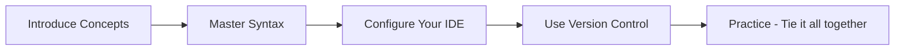

## Enablement Recommendations: Foundational Topics

## Foundational Goals and Why They Matter

The goal of this foundational document is to build the core toolset and mindset required for an Automation Specialist. Before writing your first Ansible Playbook or using AAP, you must be comfortable with the tools and concepts that the platform is built on.

The learning path below explains *what* each foundational skill is and *why* it is critical for automation.



* **Introduce Concepts:** Grasp the high-level ideas of IaC (Infrastructure as Code) and DevOps. These are the core "why" philosophies, and AAP is the tool designed to implement them. Understanding this gives your work context.
* **Master Syntax:** Write YAML syntax and use a linter to verify it. YAML is the language of Ansible; everything you write (playbooks, inventories, etc.) is in YAML. Mastering its syntax is like learning the alphabet before writing a novel.
* **Configure Your IDE:** Set up VSCode as a professional automation editor. VSCode is your workshop. With the right extensions (like the Red Hat YAML linter), it catches your YAML syntax errors before you commit them to Git, saving you hours of troubleshooting.
* **Use Version Control:** Experiment with basic git commands and workflows. Git is the "source of truth" for AAP. Your automation code (Ansible Playbooks) must be stored in Git, as AAP pulls code directly from it to run jobs. A basic workflow (clone, branch, commit, push) is a daily requirement.

## Independent Learning Path Recommendations

Build your toolset - learn some yaml, vscode, and git.  Then integrate the tools.

### Introduce Concepts

* [What is Infrastructure as Code (**IaC**)?](https://www.redhat.com/en/topics/automation/what-is-infrastructure-as-code-iac)
* [What is **DevOps**?](https://www.redhat.com/en/topics/devops/what-is-devops)

### YAML Essentials

* [YAML basics in 5 minutes](https://www.redhat.com/en/blog/yaml-basics-5-minutes)
* [YAML Essentials Cheat Sheet](https://developers.redhat.com/cheat-sheets/yaml-essentials)

### VsCode Essentials

* [Visual Studio Code](https://code.visualstudio.com/docs) download, tutorials and setup!

### Git Essentials

* [A Beginner's Guide to Git](https://developers.redhat.com/articles/2023/08/02/beginners-guide-git-version-control#)
* [Learn **Git** (References to book, videos...)](https://git-scm.com/learn)
* [Git best practices: Workflows for GitOps deployments](https://developers.redhat.com/articles/2022/07/20/git-workflows-best-practices-gitops-deployments#)

### Bring yaml, vscode and git together with extensions

* [YAML Language Support by Red Hat](https://marketplace.visualstudio.com/items?itemName=redhat.vscode-yaml)
  * **Note:** This extension provides the **YAML linting** (real-time error checking) mentioned in our goals.
* [GitLens — Git supercharged](https://marketplace.visualstudio.com/items?itemName=eamodio.gitlens)
* [Using Git source control in VS Code](https://code.visualstudio.com/docs/sourcecontrol/overview)

---

## Sanity Check

### Key Git Commands to Know

While the guides provide full details, focus on understanding this core set of commands first. This is the basic workflow you will use every day.

| Command | What it does | Example / Note |
| :--- | :--- | :--- |
| `git clone [url]` | Creates a local copy of a remote repository on your computer. | `git clone https://github.com/user/repo.git` |
| `git branch [name]` | Creates a new branch for you to work on. | `git branch feature/new-playbook` |
| `git switch [name]` | Switches your active working directory to the specified branch. | `git switch feature/new-playbook` (Replaces older `checkout` command) |
| `git status` | Shows you the current state of your repository (changed files, etc.). | You will use this constantly. |
| `git add [file]` | Stages a file, telling Git you want to include it in the next commit. | `git add .` (Stages all changed files) |
| `git commit -m "..."` | Saves a "snapshot" of your staged changes to the repository's history. | `git commit -m "Add new inventory file"` |
| `git pull` | Fetches the latest changes from the remote repository and merges them. | Keeps your local branch up-to-date. |
| `git push` | Uploads your local commits to the remote repository. | Shares your work with the team and AAP. |

### Hands-On Practice: Tying It All Together

This simple exercise will confirm you have successfully set up your environment by combining all the foundational topics.

* **Prerequisite:** [Intro to Git in VS Code](https://code.visualstudio.com/docs/sourcecontrol/intro-to-git)

Your goal is to:

1. Create a new folder (e.g., `my-automation-project`).
2. Open this folder in **VSCode**.
3. Create a new file named `inventory.yml`.
4. Write a simple **YAML** structure in this file. Use the Red Hat YAML extension to check for errors in real-time.
    > **Example `inventory.yml`:**
    >
    > ```yaml
    > ---
    > all:
    >   hosts:
    >     webserver-01:
    >       ansible_host: 192.168.1.10
    >       location: "new-york"
    >     webserver-02:
    >       ansible_host: 192.168.1.11
    >       location: "boston"
    >   vars:
    >     region: "east"
    > ```
    >
5. Use the **Git** integration in VSCode (or the command line) to:
    * Initialize a new Git repository (`git init`).
    * Add the `inventory.yml` file to staging.
    * Make your first commit (e.g., `git commit -m "Initial inventory setup"`).
