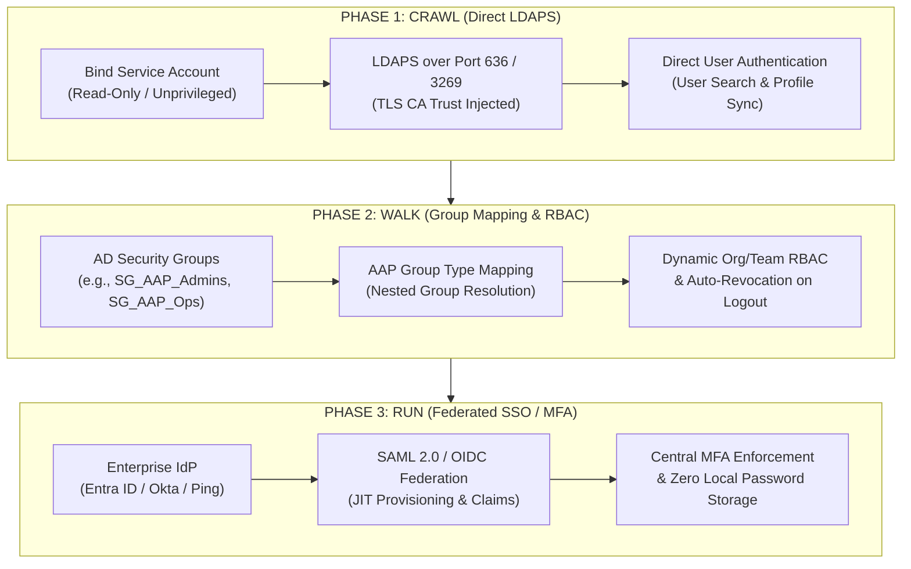

# Use Case:  Master Index & Active Directory Integration Overview

## Executive Summary

This documentation suite provides a complete end-to-end framework for integrating **Active Directory (AD)** and enterprise **Identity Providers (IdP)** with **Ansible Automation Platform 2 (AAP 2)**[cite: 1]. 

To accommodate varying enterprise maturity levels, security boundaries, and team readiness, this suite uses a **Crawl, Walk, Run** adoption model[cite: 1]. It moves from read-only LDAPS authentication to automated Role-Based Access Control (RBAC) group mapping, culminating in federated Single Sign-On (SSO) with Multi-Factor Authentication (MFA)[cite: 1].

---

## Table of Contents & Documentation Suite

| Document / Phase | Scope & Contents | Target Audience |
| :--- | :--- | :--- |
| **[01 - Phase 1: Crawl — Direct LDAPS Read-Only Integration](01-ldaps-baseline-auth.md)**[cite: 1, 2] | Firewall matrix, PKI Root CA trust injection, unprivileged bind account setup, user search filters, and basic profile attribute mapping[cite: 1, 2]. | AD Administrators, AAP Platform Engineers[cite: 1] |
| **[02 - Phase 2: Walk — Role-Based Access Control & Group Mapping](02-rbac-and-group-mapping.md)**[cite: 1, 3] | Group search filters, nested AD group handling, dynamic AAP Organization/Team mapping, and automated access revocation[cite: 1, 3]. | Security Engineers, Identity & Access Ops[cite: 1] |
| **[03 - Phase 3: Run — Enterprise SSO & Identity Federation](03-saml-oidc-sso-federation.md)**[cite: 1, 4] | SAML 2.0 / OIDC setup (Entra ID/Azure AD, Okta, Ping), Just-In-Time (JIT) provisioning, SAML claims mapping, and MFA enforcement[cite: 1, 4]. | Identity Architects, Security Compliance[cite: 1] |
| **[04 - Pre-Flight Diagnostics, `ldapsearch` & Debugging](04-troubleshooting-and-diagnostics.md)**[cite: 1, 5] | Terminal pre-flight tests, `ldapsearch` CLI validation, LDAPS SSL cert verification, `django-auth-ldap` debug logging, and edge-case fixes[cite: 1, 5]. | Platform Operations, Escalation Engineers[cite: 1] |
| **[05 - Configuration-as-Code for Identity & Access](05-controller-as-code-automation.md)**[cite: 1, 6] | Automating AAP AD/LDAP authentication settings using the `infra.controller_configuration` collection, Vault secret handling, and CI/CD pipelines[cite: 1, 6]. | DevOps Engineers, Automation Architects[cite: 1] |
| **[06 - Entra ID SAML App Manifest & Automation](06-entra-id-app-manifest-template.md)**[cite: 1, 7] | Pre-configured Microsoft Entra ID JSON app manifest, SAML assertion claims mapping, and Microsoft Graph PowerShell deployment script[cite: 1, 7]. | Identity & Access Team, Azure AD Admins[cite: 1] |
| **[07 - Execution Environment Kerberos Automation](07-ee-sssd-kerberos-integration.md)**[cite: 1, 8] | Configuring containerized Execution Environments (`ansible-builder`), `krb5.conf` staging, and passwordless Keytab automation patterns[cite: 1, 8]. | Automation Engineers, Windows Admins[cite: 1] |
| **[08 - Executive Briefing & Architecture Deck](08-executive-briefing-slides.md)**[cite: 1, 9] | Slide deck outline, architecture diagrams, risk matrix, stakeholder value positioning, and modernization timeline for customer leadership[cite: 1, 9]. | Enterprise Architects, AE / ASA Alignment[cite: 1] |

---

## Architecture Adoption Roadmap

---

## The Four Golden Rules of AD Integration in AAP 2

1. **Least Privilege Bind Account:** AAP requires zero domain administrator rights and zero Active Directory schema modifications[cite: 1]. The service account used for the LDAP bind needs only standard, unprivileged `Read` and `List Contents` permissions on target User and Group OUs[cite: 1].
2. **System-Level CA Trust for LDAPS:** LDAPS (Port 636 or Global Catalog Port 3269) will fail with `SERVER_DOWN` SSL handshake errors unless the issuing Root and Intermediate CA certificates are installed in the underlying RHEL system trust store (`/etc/pki/ca-trust/source/anchors/`) on all AAP nodes[cite: 1].
3. **Automate Revocation via AD Groups:** Always set `remove: true` (or `remove_users: true` / `remove_admins: true`) in your LDAP group maps[cite: 1]. This guarantees that removing a user from an AD Security Group instantly revokes their AAP permissions upon their next login attempt[cite: 1].
4. **Distinguish Local Domain Search from Forest Search:** Standard LDAP queries over Port 636 search only the local domain partition[cite: 1]. If user accounts or groups reside across multiple domains in an Active Directory forest, queries must target the Global Catalog port (`ldaps://dc01.yourdomain.com:3269`)[cite: 1].

---

## Primary Reference Materials

* **Red Hat Official Documentation:**
  * [AAP Controller Configuration — LDAP Authentication Guide](https://docs.redhat.com/en/documentation/red_hat_ansible_automation_platform/2.4/html/configuring_ansible_automation_platform/controller-ldap-auth)[cite: 1]
  * [AAP Controller Configuration — SAML Authentication Guide](https://docs.redhat.com/en/documentation/red_hat_ansible_automation_platform/2.4/html/configuring_ansible_automation_platform/controller-saml-auth)[cite: 1]
* **Technical Upstream References:**
  * `django-auth-ldap` Documentation & Schema Definitions[cite: 1]
  * Red Hat Ansible Certified Content Collection: `infra.controller_configuration`[cite: 1]
