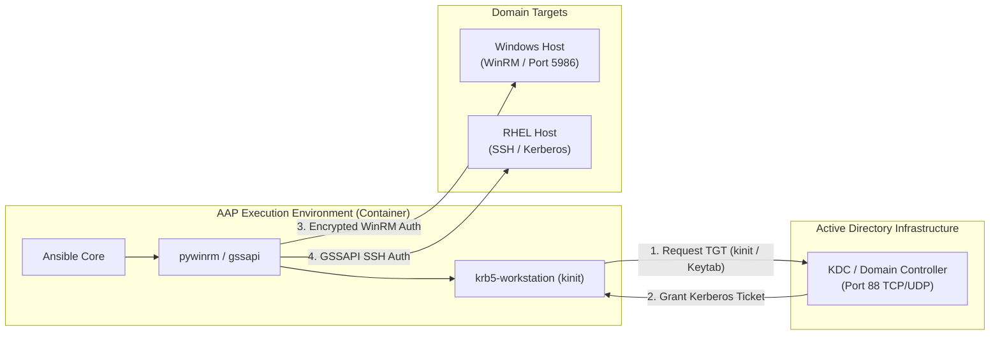

# 07-ee-sssd-kerberos-integration.md - Execution Environment Kerberos & Active Directory Automation

## Executive Summary

This guide details configuring **Ansible Execution Environments (EEs)** within **Ansible Automation Platform 2 (AAP 2)** to perform Kerberos-authenticated automation against Windows and Linux target hosts in Active Directory domains.

While preceding documents focus on authenticating users *into* the AAP platform, this guide addresses how AAP automation worker containers establish ticket-granting relationships (`krb5`), manage Keytabs, and execute Kerberos-encrypted WinRM or SSH automation against domain-joined target systems.

---

## Technical Architecture & Dependency Matrix

To enable Kerberos authentication inside containerized execution environments, the EE image must include specific system libraries, Python packages, and a valid `/etc/krb5.conf` configuration.



---

## Building a Kerberos-Enabled Execution Environment (`ansible-builder`)

Use `ansible-builder` (v3 format) to define and build a custom EE containing Kerberos dependencies.

### 1. `execution-environment.yml`

```yaml
version: 3
images:
  base_image:
    name: registry.redhat.io/ansible-automation-platform-24/ee-supported-rhel9:latest

dependencies:
  python: requirements.txt
  system: bindep.txt

additional_build_files:
  - src: krb5.conf
    dest: configs

additional_build_steps:
  append_final:
    - COPY configs/krb5.conf /etc/krb5.conf
    - RUN chmod 644 /etc/krb5.conf
```

### 2. Python Dependencies (`requirements.txt`)

```text
pywinrm[kerberos]>=0.4.3
pypsrp[kerberos]>=0.8.0
requests-kerberos>=0.14.0
gssapi>=1.8.0
```

### 3. System Packages (`bindep.txt`)

```text
krb5-workstation [platform:rpm]
krb5-libs [platform:rpm]
krb5-devel [platform:rpm]
gcc [platform:rpm]
python3-devel [platform:rpm]
```

---

## Enterprise `krb5.conf` Configuration Template

Place this file in your EE build directory as `krb5.conf`. It configures domain-to-realm mappings, default encryption types, and Domain Controller KDCs.

```ini
[libdefaults]
    default_realm = YOURDOMAIN.COM
    dns_lookup_realm = false
    dns_lookup_kdc = true
    ticket_lifetime = 24h
    renew_lifetime = 7d
    forwardable = true
    rdns = false
    pkinit_anchors = /etc/pki/tls/certs/ca-bundle.crt
    default_tkt_enctypes = aes256-cts-hmac-sha1-96 aes128-cts-hmac-sha1-96
    default_tgs_enctypes = aes256-cts-hmac-sha1-96 aes128-cts-hmac-sha1-96

[realms]
    YOURDOMAIN.COM = {
        kdc = dc01.yourdomain.com:88
        kdc = dc02.yourdomain.com:88
        admin_server = dc01.yourdomain.com
        default_domain = yourdomain.com
    }

[domain_realm]
    .yourdomain.com = YOURDOMAIN.COM
    yourdomain.com = YOURDOMAIN.COM
```

---

## Playbook Execution Patterns

### Pattern A: Standard Credential-Based Kerberos WinRM (No Keytab)

AAP Controller handles password-based Kerberos authentication automatically when inventory variables dictate `ansible_connection: winrm` and `ansible_winrm_transport: kerberos`.

#### Group Variables (`group_vars/windows.yml`):
```yaml
---
ansible_connection: winrm
ansible_port: 5986
ansible_winrm_transport: kerberos
ansible_winrm_server_cert_validation: validate
ansible_user: "svc_ansible_win@YOURDOMAIN.COM"
# Note: Realm MUST be uppercase in ansible_user for Kerberos routing
```

---

### Pattern B: Keytab-Based Passwordless Kerberos Authentication

For secure, passwordless automation, load a Base64-encoded Kerberos Keytab from **Ansible Vault** or a secret manager at runtime, write it to a temporary file, and execute `kinit`.

#### Playbook Example (`manage_ad_hosts.yml`):
```yaml
---
- name: Automate Windows Domain Targets via Keytab Kerberos
  hosts: tag_Environment_Production
  gather_facts: false

  vars:
    kerberos_realm: "YOURDOMAIN.COM"
    kerberos_user: "svc_automation@{{ kerberos_realm }}"
    keytab_path: "/tmp/svc_automation.keytab"

  tasks:
    - name: Stage Encrypted Keytab from Vault
      ansible.builtin.copy:
        content: "{{ vault_keytab_b64 | b64decode }}"
        dest: "{{ keytab_path }}"
        mode: '0600'
      delegate_to: localhost
      no_log: true

    - name: Obtain Kerberos Ticket-Granting Ticket (TGT)
      ansible.builtin.command:
        cmd: "kinit -kt {{ keytab_path }} {{ kerberos_user }}"
      delegate_to: localhost
      changed_when: false
      no_log: true

    - name: Run Windows Automation Command
      ansible.windows.win_powershell:
        script: |
          Get-Service -Name Spooler
      register: service_status

    - name: Cleanup Temporary Keytab and Ticket
      ansible.builtin.file:
        path: "{{ item }}"
        state: absent
      delegate_to: localhost
      loop:
        - "{{ keytab_path }}"
      always: true
```

---

## Troubleshooting EE Kerberos Connections

If winrm or Kerberos connection tasks fail inside an Execution Environment task run:

### 1. Test KDC Line-of-Sight (Port 88)
```bash
nc -zvw3 dc01.yourdomain.com 88
```

### 2. Manual `kinit` Verification inside EE Container
Run the container interactively using `podman` to test ticket creation:

```bash
podman run --rm -it [your-registry.com/ee-kerberos:latest](https://your-registry.com/ee-kerberos:latest) bash

# Test password-based TGT acquisition
kinit user@YOURDOMAIN.COM

# List active Kerberos tickets
klist
```

### 3. Common Errors & Fixes

| Error Message | Root Cause | Fix |
| :--- | :--- | :--- |
| **`KDC has no support for encryption type`** | Active Directory domain requires AES-256/128, but `krb5.conf` uses legacy DES/RC4. | Add `default_tkt_enctypes = aes256-cts-hmac-sha1-96 aes128-cts-hmac-sha1-96` to `[libdefaults]`. |
| **`Cannot find KDC for realm`** | Domain name lowercase or DNS lookup failed inside container. | Ensure realm is uppercase (`YOURDOMAIN.COM`) in variable inputs and `krb5.conf`. |
| **`Kerberos Auth Failed: Certificate invalid`** | SSL certificate CN/SAN does not match WinRM target hostname. | Verify `ansible_host` uses full FQDN matching the TLS cert (e.g., `winserver01.yourdomain.com`). |
