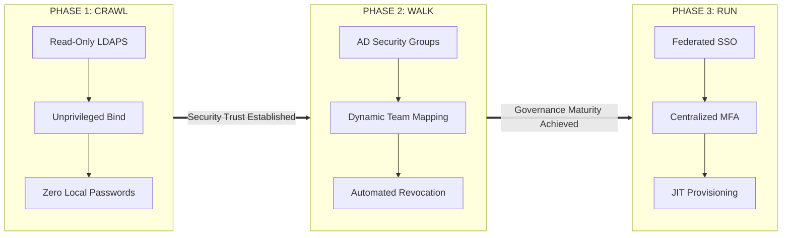
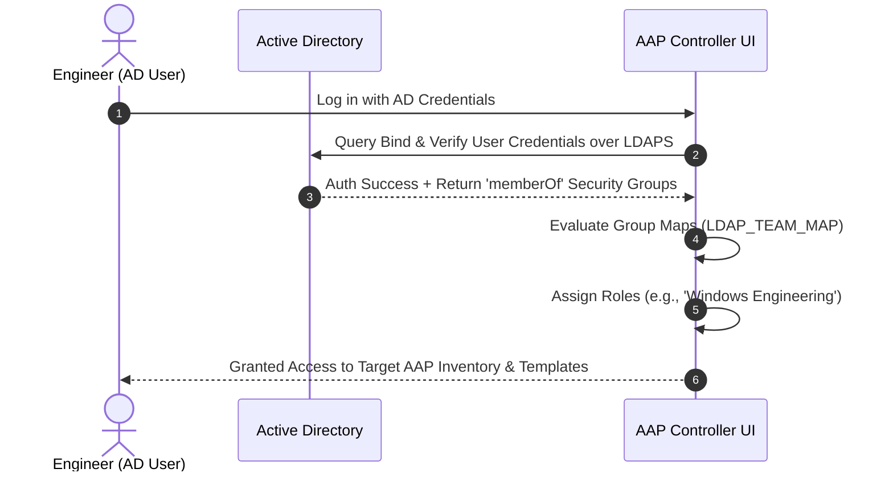
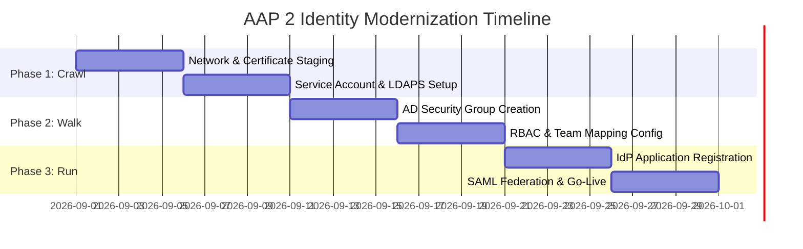

# 08-executive-briefing-slides.md - Executive Briefing & Architecture Deck: Active Directory Integration for AAP 2

## Presentation Overview

This slide deck framework provides executive, security, and infrastructure leadership with an architecture-level briefing on integrating **Active Directory (AD)** and enterprise **Identity Providers (IdP)** with **Ansible Automation Platform 2 (AAP 2)** using a progressive **Crawl, Walk, Run** strategy.

---

---

## Slide 1: Executive Overview & Business Justification

### Strategic Objective
Modernize and secure identity lifecycle management across Ansible Automation Platform 2 without compromising domain security boundaries, increasing administrative overhead, or introducing local password risk.

### Key Value Pillars
* **Zero Local Credential Storage:** Eliminate local user passwords in AAP by delegating authentication to enterprise Active Directory and federated Identity Providers.
* **Automated Governance:** Synchronize Role-Based Access Control (RBAC) dynamically with AD Security Groups, ensuring immediate access revocation upon employee offboarding.
* **Zero Schema Modifications:** Integrate natively over encrypted protocols (LDAPS / SAML 2.0) using unprivileged service accounts without requiring Domain Admin rights or AD schema updates.
* **Compliance Alignment:** Enforce Multi-Factor Authentication (MFA), centralized logging, and audit-ready access governance across the automation estate.

---

---

## Slide 2: The Crawl, Walk, Run Modernization Framework

---

---

## Slide 3: Architecture & Adoption Risk Matrix

| Parameter | Phase 1: Crawl (LDAPS) | Phase 2: Walk (Group RBAC) | Phase 3: Run (SAML/SSO) |
| :--- | :--- | :--- | :--- |
| **Primary Protocol** | Direct LDAPS (Port 636/3269) | Direct LDAPS (Port 636/3269) | SAML 2.0 / OIDC (Port 443) |
| **AD Rights Required** | Read-Only (Domain Users) | Read-Only (Domain Users) | App Registration / Claims |
| **User Authentication** | Enterprise Password | Enterprise Password | Federated Single Sign-On |
| **Access Control (RBAC)** | Manual / Local Assignment | Automated via AD Groups | Automated via SAML Claims |
| **MFA Enforcement** | Domain / Network Level | Domain / Network Level | Mandatory IdP Enforcement |
| **AD Team Workload** | 1 Unprivileged Service Acct | 2–3 AD Security Groups | IdP Enterprise App Setup |
| **Risk Level** | **Low** | **Low** | **Lowest** |

---

---

## Slide 4: Governance & Access Lifecycle (Walk Phase)

### Dynamic Role Assignment Model
Instead of manually managing user accounts inside individual platform consoles, access control is governed through Active Directory Security Groups.

### Offboarding Safeguard
When an employee changes roles or departs the organization, removing them from the designated AD Security Group automatically revokes their AAP permissions upon their next login attempt (`remove: true`).

---

---

## Slide 5: Enterprise SSO & MFA Compliance (Run Phase)

### Key Security Outcomes
* **No Direct Passwords:** AAP never receives, sees, or stores user passwords. Authentication is offloaded to the central Identity Provider (e.g., Entra ID / Azure AD, Okta, PingFederate).
* **Conditional Access Enforcement:** Network location rules, device compliance policies, and Risk-Based Conditional Access are enforced prior to granting access to AAP.
* **Mandatory MFA:** Satisfies enterprise security mandates requiring Multi-Factor Authentication for all administrative web consoles.
* **Just-In-Time (JIT) Provisioning:** User accounts are provisioned dynamically on their initial SSO redirect, eliminating pre-provisioning overhead.

---

---

## Slide 6: Stakeholder Win Matrix

### Active Directory / Identity Team
* Zero schema changes or domain privilege escalation required.
* 100% control over access governance via existing AD Security Groups.
* Zero local account sprawl or orphaned user credentials to manage.

### Cybersecurity & Compliance Team
* Fully aligns with Zero Trust Architecture (ZTA) and Least Privilege principles.
* Centralized audit logging of all authentication events and access grants.
* Enforces central MFA and automated access revocation policies.

### Automation Platform Engineering Team
* Eliminates operational overhead of manual user provisioning and resetting passwords.
* Provides seamless Single Sign-On user experience for automation engineers.
* Fully automated Configuration-as-Code deployment via Ansible collections.

---

---

## Slide 7: Implementation Roadmap & Next Steps

### Next Action Items
1. **Network Egress Verification:** Request firewall rules for Port 636/3269 to Domain Controllers.
2. **Service Account Provisioning:** Issue request for unprivileged read-only LDAP bind account.
3. **Group Naming Standard:** Establish naming conventions for AAP AD Security Groups (e.g., `SG_AAP_Admins`, `SG_AAP_Operators`).
