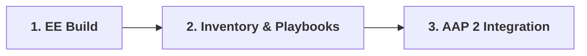

# Use Case: Windows Kerberos Automation Execution Environment

This repo provides guides for automating Active Directory-joined Windows endpoints using Ansible Automation Platform (AAP 2) with native Kerberos over WinRM HTTPS (Port 5986).

It covers the lifecycle—from building custom execution containers to running playbooks with focus on air-gapped environments.

---

## Index of Topics

Topics:

### 1. [Execution Environment Build Guide](01-execution-environment.md)

* **Focus:** Compiling a custom Execution Environment container image with `ansible-builder`, system Kerberos binaries (`krb5-workstation`), Python dependencies (`pywinrm[kerberos]`), and a pre-configured `/etc/krb5.conf`.
* **Key Topics:**
  * Standard vs. Air-Gapped / Disconnected build requirements
  * Kerberos realm configuration (`krb5.conf`) rules
  * Container definition (`execution-environment.yml`) and registry publishing

### 2. [Inventory & Playbooks Guide](02-inventory-and-playbooks.md)

* **Focus:** Structuring inventory connection variables for Kerberos authentication and writing domain-ready Windows playbooks.
* **Key Topics:**
  * WinRM HTTPS connection variables (`ansible_winrm_transport: kerberos`)
  * Target host domain prerequisites and the FQDN mandate
  * Ready-to-use sample playbooks for connectivity and service management

### 3. [AAP 2 UI Integration & Execution Guide](03-aap-integration.md)

* **Focus:** End-to-end integration inside the AAP 2 Controller web console and job execution mechanics.
* **Key Topics:**
  * Decoupling assets into Execution Environments, Projects, Inventories, and Credentials
  * Building and launching Job Templates
  * Interactive job execution flow and automated `kinit` ticket acquisition
  * Common failure troubleshooting matrix and air-gapped checklist

### 4. Prerequisites [Enterprise Infrastructure & Team Alignment Guide](04-infrastructure-and-team-prerequisites.md)

* **Focus:** Prerequisites.  Cross-team technical alignment, network firewall requirements, Active Directory prerequisites, and enterprise PKI/CRL trust configurations.
* **Key Topics:**
  * Non-technical stakeholder and domain team alignment matrix
  * Network port matrix and DNS resolution requirements
  * Active Directory Kerberos formatting and NTP clock sync rules
  * Enterprise CA trust store embedding and CRL reachability handling

### 5. Prerequisites [Disconnected Supply Chain & Air-Gapped Build Guide](05-airgapped-supply-chain-guide.md)

* **Focus:** Prerequisites.  Offline supply chain management for building Execution Environments without internet access.
* **Key Topics:**
  * Base image mirroring using `skopeo`
  * Offline Python wheel bundling for `pywinrm[kerberos]`
  * Local Ansible Collection packaging and `requirements.yml` setup
  * Offline RHEL RPM repository handling and pre-flight validation

---

## Onboarding Workflow

Follow these modules in order to build, structure, and execute your automation:

---
