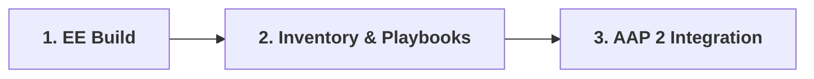

# Use Case: Windows Kerberos Automation in AAP 2

Welcome to the enterprise implementation guide for automating Active Directory-joined Windows endpoints using Ansible Automation Platform (AAP 2) with native Kerberos over WinRM HTTPS (Port 5986).

This guide is structured for Windows administrators and automation engineers transitioning to containerized execution environments. It covers the full lifecycle—from building custom execution containers to running playbooks in connected or air-gapped environments.

---

## Documentation Index

The complete guide is organized into three sequential modules:

### 1. [Use Case: Execution Environment Build Guide](01-execution-environment.md)

* **Focus:** Compiling a custom Execution Environment container image with `ansible-builder`, system Kerberos binaries (`krb5-workstation`), Python dependencies (`pywinrm[kerberos]`), and a pre-configured `/etc/krb5.conf`.
* **Key Topics:**
  * Standard vs. Air-Gapped / Disconnected build requirements
  * Kerberos realm configuration (`krb5.conf`) rules
  * Container definition (`execution-environment.yml`) and registry publishing

### 2. [Use Case: Inventory & Playbooks Guide](02-inventory-and-playbooks.md)

* **Focus:** Structuring inventory connection variables for Kerberos authentication and writing domain-ready Windows playbooks.
* **Key Topics:**
  * WinRM HTTPS connection variables (`ansible_winrm_transport: kerberos`)
  * Target host domain prerequisites and the FQDN mandate
  * Ready-to-use sample playbooks for connectivity and service management

### 3. [Use Case: AAP 2 UI Integration & Execution Guide](03-aap-integration.md)

* **Focus:** End-to-end integration inside the AAP 2 Controller web console and job execution mechanics.
* **Key Topics:**
  * Decoupling assets into Execution Environments, Projects, Inventories, and Credentials
  * Building and launching Job Templates
  * Interactive job execution flow and automated `kinit` ticket acquisition
  * Common failure troubleshooting matrix and air-gapped checklist

---

## Onboarding Workflow

Follow these modules in order to build, structure, and execute your automation:

---

## Golden Rules for Kerberos in AAP 2

Always keep these four non-negotiable rules in mind when working with Kerberos and Ansible:

1. **ALL-CAPS Realm Names:** Realm names in `krb5.conf` and Machine Credential usernames MUST be uppercase (e.g., `ansible_svc@YOURDOMAIN.COM`). Kerberos is case-sensitive.
2. **FQDNs Required in Inventories:** Target hosts MUST use Fully Qualified Domain Names (e.g., `win01.yourdomain.com`). Kerberos requires FQDNs to generate Service Principal Name (SPN) tickets; IP addresses will always fail.
3. **NTP Clock Sync:** Time drift across AAP execution nodes, Active Directory Domain Controllers, and target Windows servers must remain under 5 minutes.
4. **Internal DNS Resolution:** Execution Environment containers must resolve host FQDNs and Active Directory Domain Controllers via internal DNS.

---
