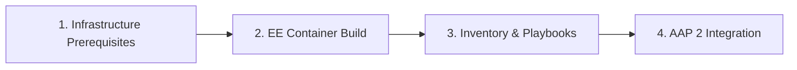

# Active Directory Windows Automation: Execution Environment Framework

Execution environment specifications for automating Active Directory-joined Windows endpoints using Ansible Automation Platform (AAP 2) via native Kerberos over WinRM HTTPS (Port 5986).

---

## Deployment Sequence

Modules must be executed sequentially. Infrastructure prerequisites and container build steps must be locked before configuring assets inside AAP.

### 1. Prerequisites: Infrastructure & Team Alignment
* **File:** `04-infrastructure-and-team-prerequisites.md`
* **Scope:** Network egress rules (Ports 88, 464, 389/636, 5986, 53), AD service account specifications, FQDN/PTR DNS records, NTP time sync, and enterprise Root CA certificates.

### 2. Execution Environment Build Guide
* **File:** `01-execution-environment.md`
* **Scope:** Container image compilation via `ansible-builder`, system Kerberos binaries (`krb5-workstation`), Python dependencies (`pywinrm[kerberos]`), `krb5.conf` formatting, and internal Root CA trust embedding.

### 3. Inventory & Playbooks Guide
* **File:** `02-inventory-and-playbooks.md`
* **Scope:** WinRM HTTPS connection variables (`ansible_winrm_transport: kerberos`), target host FQDN mandates, and domain-ready playbooks.

### 4. AAP 2 UI Integration & Execution Guide
* **File:** `03-aap-integration.md`
* **Scope:** Asset registration in AAP Controller (Execution Environments, Projects, Inventories, Credentials), Job Templates, and automated `kinit` ticket acquisition.

### 5. Disconnected Supply Chain & Air-Gapped Build Guide
* **File:** `05-airgapped-supply-chain-guide.md`
* **Scope:** Offline dependency staging using `skopeo` base image mirroring, local Python wheel packaging, and offline Ansible Collection tarballs.

---

## Onboarding Workflow

---
