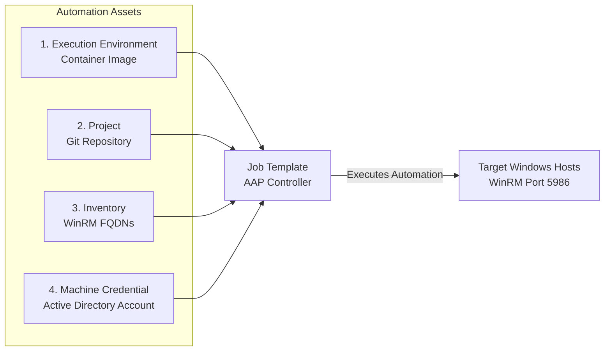
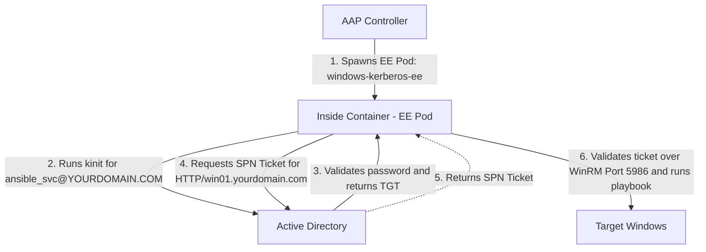

# Use Case: AAP 2 UI Integration & Execution Guide

This guide provides a high-level walkthrough of how to integrate your custom Execution Environment (EE), inventory, playbooks, and Active Directory credentials into Red Hat Ansible Automation Platform (AAP 2) to execute end-to-end Windows automation.

---

## Table of Contents

* [1. Integration Architecture Overview](#1-integration-architecture-overview)
* [2. Step-by-Step AAP UI Configuration](#2-step-by-step-aap-ui-configuration)
  * [Step 1: Add Execution Environment](#step-1-add-execution-environment)
  * [Step 2: Create Git Project](#step-2-create-git-project)
  * [Step 3: Configure Inventory](#step-3-configure-inventory)
  * [Step 4: Create Machine Credential](#step-4-create-machine-credential)
  * [Step 5: Build Job Template](#step-5-build-job-template)
* [3. Job Execution Sequence](#3-job-execution-sequence)
* [4. Troubleshooting and Verification](#4-troubleshooting-and-verification)
* [5. Air-Gapped AAP Operational Checklist](#5-air-gapped-aap-operational-checklist)
* [6. Optional: Automating AAP Setup with Configuration-as-Code](#6-optional-automating-aap-setup-with-configuration-as-code)

---

## 1. Integration Architecture Overview

In AAP 2, job execution relies on decoupling your automation assets into four distinct components that converge inside a **Job Template**:

1. **Execution Environment (EE):** Container image containing system Kerberos binaries (`krb5-workstation`), Python packages (`pywinrm[kerberos]`), and `/etc/krb5.conf`.
2. **Project:** Git repository containing your Windows playbooks.
3. **Inventory:** Group or host definitions specifying target Windows FQDNs and WinRM connection variables.
4. **Machine Credential:** Active Directory domain account username and password.

The diagram below illustrates how these four components map directly into the Job Template at execution:



When a Job Template launches, AAP spawns the EE container, passes the Active Directory credentials to run an automated `kinit`, attaches the inventory and playbook, and executes the tasks over encrypted WinRM (port 5986).

---

## 2. Step-by-Step AAP UI Configuration

### Step 1: Add Execution Environment

Register the container image built during the EE setup process:

1. Log into the AAP Controller web console.
2. In the left navigation menu, go to **Administration** -> **Execution Environments**.
3. Click **Add**.
4. Fill in the required fields:
   * **Name:** `Windows Kerberos EE`
   * **Image:** `my-registry.com/my-project/windows-kerberos-ee:latest`
   * **Pull:** `Always` or `Missing` (depending on registry update strategy)
5. Click **Save**.

### Step 2: Create Git Project

Connect AAP to the repository storing your playbooks and YAML inventory files:

1. Navigate to **Resources** -> **Projects** -> **Add**.
2. Configure project settings:
   * **Name:** `Windows Automation Playbooks`
   * **Source Control Type:** `Git`
   * **Source Control URL:** `https://git.yourdomain.com/ansible/windows-playbooks.git`
   * **Source Control Credential:** (Select your Git access token or SSH key if repository is private)
3. Click **Save** and verify the initial sync succeeds.

### Step 3: Configure Inventory

Create or sync your Windows target host inventory:

1. Navigate to **Resources** -> **Inventories** -> **Add** -> **Add Inventory**.
2. Name the inventory (e.g., `Windows Production Domain`).
3. Under the **Variables** tab, paste your WinRM connection settings:

   ```yaml
   ansible_connection: winrm
   ansible_winrm_transport: kerberos
   ansible_port: 5986
   ansible_winrm_scheme: https
   ansible_winrm_server_cert_validation: ignore # Change to 'validate' for hardened production
   ```

   > **Production Hardening Note:** Use `ignore` for initial testing. Once your internal Root CA is embedded in the EE container (as detailed in `01-execution-environment.md`), change this variable to `validate`.

4. Add target hosts under the **Hosts** tab, ensuring every entry uses a Fully Qualified Domain Name (e.g., `win01.yourdomain.com`).

### Step 4: Create Machine Credential

Define the Active Directory service account used by AAP to request Kerberos tickets:

1. Navigate to **Resources** -> **Credentials** -> **Add**.
2. Set credential properties:
   * **Name:** `AD Ansible Service Account`
   * **Credential Type:** `Machine`
   * **Username:** Use User Principal Name (UPN) format with uppercase domain (e.g., `ansible_svc@YOURDOMAIN.COM`).
   * **Password:** Enter the Active Directory account password.
3. Click **Save**.

### Step 5: Build Job Template

Combine all components into an executable job template:

1. Navigate to **Resources** -> **Templates** -> **Add** -> **Add job template**.
2. Complete the template definition:
   * **Name:** `Windows Service Management`
   * **Job Type:** `Run`
   * **Inventory:** `Windows Production Domain`
   * **Project:** `Windows Automation Playbooks`
   * **Execution Environment:** `Windows Kerberos EE`
   * **Playbook:** Select `win_manage_services.yml`
   * **Credentials:** Attach `AD Ansible Service Account`
3. Click **Save**.

---

## 3. Job Execution Sequence

When you click **Launch** on the Job Template, AAP executes the following automated lifecycle:



---

## 4. Troubleshooting and Verification

If a job fails during execution, check these common failure points:

| Symptom / Error | Root Cause | Resolution |
| :--- | :--- | :--- |
| `kinit: Cannot find KDC for realm` | Incorrect domain capitalization or missing KDC mapping in `krb5.conf`. | Ensure domain name is ALL CAPS in `krb5.conf` and credential username. |
| `Kerberos Ticket expired` or `Clock skew too great` | System time drift between AAP nodes and Domain Controller exceeds 5 minutes. | Synchronize NTP across execution nodes, AD DCs, and Windows endpoints. |
| `Cannot resolve KDC / Hostname` | Container lacks DNS access to Active Directory. | Update container pod network settings or host `/etc/resolv.conf` to point to internal DNS. |
| `HTTP 401 Unauthorized` | Target entry used an IP address instead of an FQDN. | Update inventory hosts to use FQDN entries (e.g., `win01.yourdomain.com`). |
| `ssl.SSLCertVerificationError` | Issuing CA missing from container trust store, or cert SAN does not match target FQDN. | Embed enterprise Root CA into `/etc/pki/ca-trust/source/anchors/` in `01-execution-environment.md` and rebuild EE. |
| WinRM connection hangs 30–60s then times out | Container cannot reach Certificate Revocation List (CRL) or OCSP URL inside target cert. | Ensure internal CRL HTTP/LDAP endpoints are network-accessible from container pods in air-gapped zones. |

---

## 5. Air-Gapped AAP Operational Checklist

For disconnected/air-gapped enterprise environments, verify these prerequisites before running job templates:

* **Registry Credentials:** If your internal container registry requires authentication, configure a **Container Registry** credential in AAP (**Resources** -> **Credentials**) and attach it to your Execution Environment.
* **Pre-Loaded Automation Hub:** Ensure required collections (`ansible.windows`, `microsoft.ad`) are available on local Private Automation Hub or included in the EE image during `ansible-builder` compile time.
* **Local Git Mirroring:** Ensure the Project URL points to an internal self-hosted Git server (e.g., GitLab, Gitea, or Bitbucket Server).
* **Enterprise Root CA & CRL Access:** Ensure internal Root/Intermediate CAs are embedded in the EE image and that CRL endpoints listed in target server certificates are reachable across air-gapped subnets.

---

## 6. Optional: Automating AAP Setup with Configuration-as-Code

Once your team is comfortable with the AAP UI, you can automate the creation of these resources using the official `infra.controller_configuration` Ansible collection. This allows you to manage your AAP settings as code inside Git.

### Prerequisites
Install the collection on your admin control node:
```bash
ansible-galaxy collection install infra.controller_configuration
```

### Automation Playbook (`configure_aap_resources.yml`)

Save the following playbook to provision the Execution Environment, Inventory, Machine Credential, and Job Template automatically:

```yaml
---
- name: Provision Windows Kerberos Automation Assets in AAP
  hosts: localhost
  connection: local
  gather_facts: false
  vars:
    # AAP Controller Connection Settings
    controller_hostname: "[https://aap.yourdomain.com](https://aap.yourdomain.com)"
    controller_username: "admin"
    controller_password: "YourSecurePassword"
    controller_validate_certs: false

  tasks:
    - name: Register Execution Environment
      infra.controller_configuration.execution_environment:
        name: "Windows Kerberos EE"
        image: "[my-registry.com/my-project/windows-kerberos-ee:latest](https://my-registry.com/my-project/windows-kerberos-ee:latest)"
        pull: "always"
        state: present

    - name: Create Git Project
      infra.controller_configuration.project:
        name: "Windows Automation Playbooks"
        scm_type: "git"
        scm_url: "[https://git.yourdomain.com/ansible/windows-playbooks.git](https://git.yourdomain.com/ansible/windows-playbooks.git)"
        state: present

    - name: Create AD Machine Credential
      infra.controller_configuration.credential:
        name: "AD Ansible Service Account"
        credential_type: "Machine"
        inputs:
          username: "ansible_svc@YOURDOMAIN.COM"
          password: "YourADAccountPassword"
        state: present

    - name: Create Windows Inventory with Connection Vars
      infra.controller_configuration.inventory:
        name: "Windows Production Domain"
        variables:
          ansible_connection: "winrm"
          ansible_winrm_transport: "kerberos"
          ansible_port: 5986
          ansible_winrm_scheme: "https"
          ansible_winrm_server_cert_validation: "ignore" # Set to 'validate' for hardened production
        state: present

    - name: Create Job Template
      infra.controller_configuration.job_template:
        name: "Windows Service Management"
        job_type: "run"
        inventory: "Windows Production Domain"
        project: "Windows Automation Playbooks"
        execution_environment: "Windows Kerberos EE"
        playbook: "win_manage_services.yml"
        credentials:
          - "AD Ansible Service Account"
        state: present
```