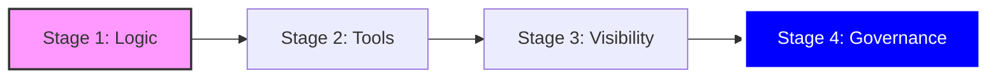

# Final Review: The Acme Automation Journey

## Executive Summary

The goal of this path was to transition from manual, high-risk administrative tasks to a governed, automated **Infrastructure as Code (IaC)** model. By following these four stages, you have built the foundation required to support Acme’s **Zero Trust Architecture**.

---

## Stage 1: The Foundation (Logic)

* **Key Concept:** Writing YAML playbooks and understanding the "Ansible Way."
* **Zero Trust Focus:** **Pillar 2 (Device Identity).** Verifying that a device is what it says it is.
* **Takeaway:** You learned that **Facts** provide the telemetry needed to make security decisions.
* **Artifacts:** `inventory.ini`, `discovery_lab.yml`.

## Stage 2: The Toolbox (Certified Content)

* **Key Concept:** Leveraging **Red Hat Certified Collections** to use vendor-supported code.
* **Zero Trust Focus:** **Pillar 7 (Visibility).** Using trusted tools (Microsoft, Cisco, Red Hat) to audit deep system settings.
* **Takeaway:** Don't reinvent the wheel. Use **Fully Qualified Collection Names (FQCN)** to call hardened, professional modules.
* **Artifacts:** `requirements.yml`, `collections/`.

## Stage 3: The Source of Truth (Dynamic Inventory)

* **Key Concept:** Replacing static text files with **Inventory Plugins** that talk to APIs.
* **Zero Trust Focus:** **Continuous Monitoring.** Automating the discovery of "Shadow IT" and ensuring no asset is left unmanaged.
* **Takeaway:** The infrastructure (AWS, Azure, VMware) is the only "Source of Truth." Use **Keyed Groups** to organize hosts by real-time metadata.
* **Artifacts:** `acme_aws_inventory.yml` (or similar plugin config).

## Stage 4: The Enterprise Hub (AAP & Git)

* **Key Concept:** Centralizing execution in the **Ansible Automation Platform**.
* **Zero Trust Focus:** **Pillar 1 (User Identity) & Pillar 6 (Orchestration).** Enforcing **Least Privilege** through Role-Based Access Control (RBAC).
* **Takeaway:** The CLI is for development; AAP is for production. Store code in **Git**, encrypt secrets in **AAP Credentials**, and scale via **Job Templates**.
* **Artifacts:** Git Repository, AAP Job Templates, Surveys.

---

## The Zero Trust Compliance Checklist

As you move into production at Acme, every automation you build should answer these three questions:

1. **Visibility:** Does this playbook provide telemetry for **Pillar 7**?
2. **Least Privilege:** Does the AAP Job Template use the minimum credential required for the task (**Pillar 1**)?
3. **Policy Enforcement:** Does this automation ensure the device stays in its "Target State" (**Pillar 2**)?

---

## Continuing Your Education

* **Acme Internal Git:** Review existing playbooks to see Stage 2 and 3 in practice.
* **Red Hat Training:** Use the [Ansible Interactive Labs](https://www.redhat.com/en/interactive-labs/ansible) for deep dives into specific collections.
* **Zero Trust Frameworks:** Keep the [DoD Zero Trust Strategy](https://dodcio.defense.gov/library/) as your north star for all security automation.

---

### Closing Note

Automation is not a "one and done" task—it is a continuous evolution. As Acme’s infrastructure changes, your playbooks and inventories must adapt. You now have the skills to build, scale, and secure that environment.
