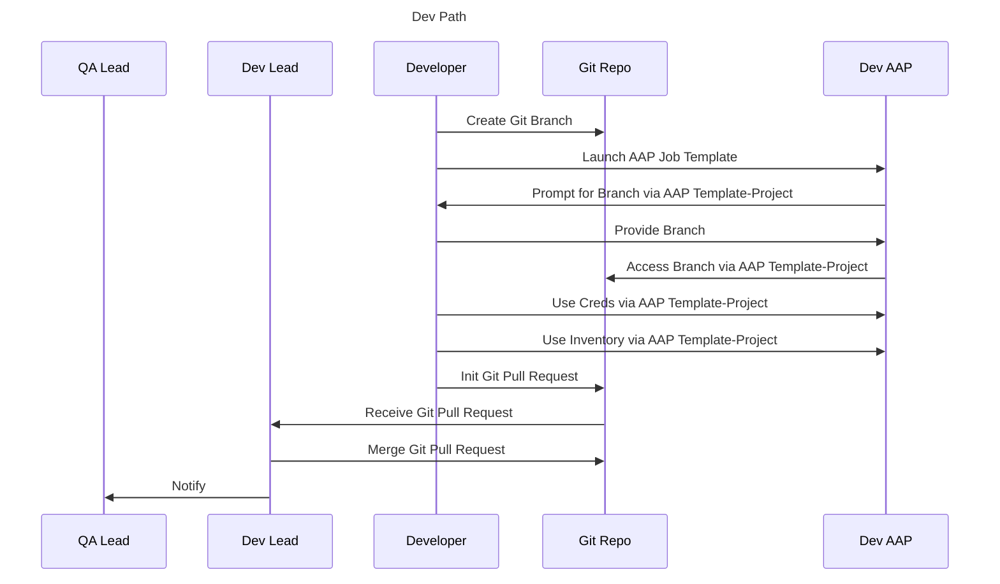
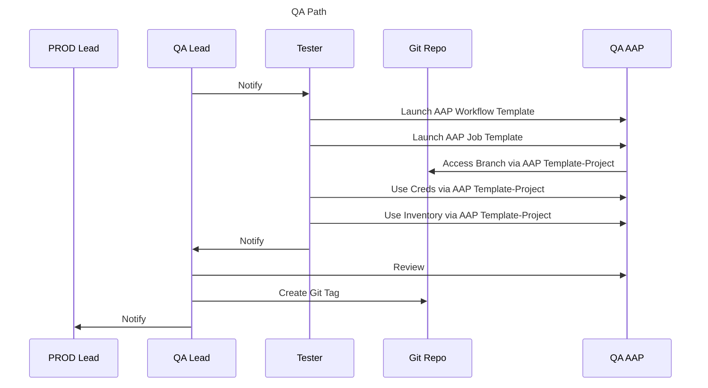
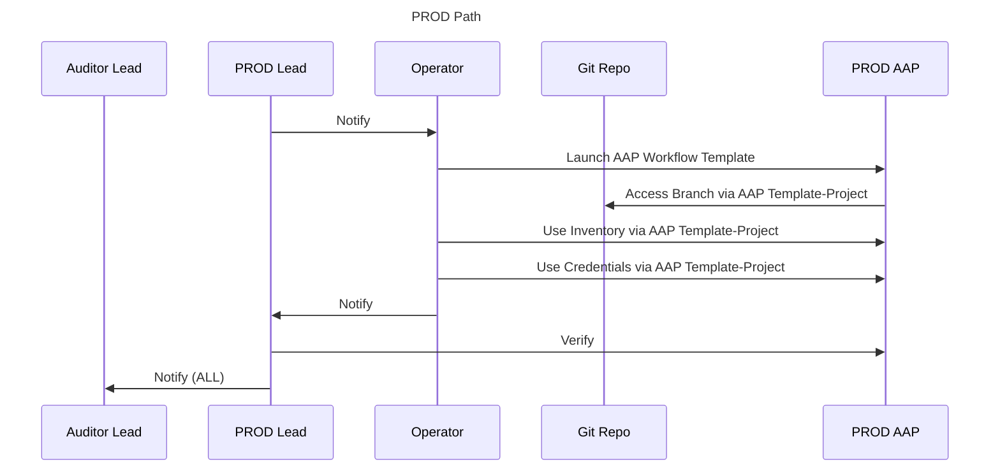

# Ansible Automation Platform (AAP) - Persona-Based RBAC Model

This use case outlines a persona-based model for implementing Role-Based Access Control (RBAC) in Ansible Automation Platform (AAP), complete with a governance matrix and ideas for an implementation plan.

## Personas (The "Who")

This table defines the key people and their generic roles *before* we map them to AAP.

| Area of Responsibility | Project Team | Persona | Generic Job Description |
| :--- | :--- | :--- | :--- |
| Platform Management | Platform Team | Platform Admin | Manages the company's central IT platforms. Responsible for uptime, security, and integration of enterprise-wide tools. |
| Organization Management | Org Governance Team | Org Admin | Governs a specific business unit. Accountable for all resources, data, and compliance within that unit. |
| Automation Lifecycle | AppDev Team | Team Lead | Leads a development team. Responsible for managing developers, assigning tasks, and overseeing the development lifecycle. |
| Automation Lifecycle | AppDev Team | Developer | Writes, tests, and maintains application code and automation scripts. Responsible for the functional quality of the software. |
| Automation Lifecycle | AppOps Team | Team Lead | Leads an operations team. Responsible for managing operators, ensuring service uptime, and coordinating production activities. |
| Automation Lifecycle | AppOps Team | Operator | Executes standard operating procedures (SOPs) in production. Responsible for running pre-approved tasks and monitoring systems. |
| Automation Lifecycle | QA Team | QA Lead | Leads the QA team. Responsible for test strategy and signing off on automation quality before production release. |
| Automation Lifecycle | QA Team | QA Tester | Executes tests on automation in a pre-production environment to validate functionality and safety. |
| Automation Lifecycle | Compliance Team | Team Lead | Leads a compliance team. Responsible for managing auditors and ensuring all processes meet regulatory requirements. |
| Automation Lifecycle | Compliance Team | Auditor | Reviews and verifies that all activities adhere to company policy and legal regulations. Responsible for generating audit reports. |

## Governance Matrix (RACI)

This matrix demonstrates roles and responsibilities for managing and using the automation platform.

**Roles:**

* **R** = Responsible (Does the work)
* **A** = Accountable (Owns the outcome; must approve)
* **C** = Consulted (Provides input)
* **I** = Informed (Is kept in the loop)

| Task / Activity | Platform Admin | Org Admin | Dev Lead | Developer | Ops Lead | Operator | QA Lead | QA Tester | Audit Lead | Auditor |
| :--- | :---: | :---: | :---: | :---: | :---: | :---: | :---: | :---: | :---: | :---: |
| **Platform Management** | | | | | | | | | | |
| 1. Install, Upgrade, & Patch AAP | **R, A** | I | I | I | I | I | I | I | I | I |
| 2. Configure Authentication (SAML/LDAP) | **R, A** | C | I | I | I | I | I | I | I | I |
| 3. Create/Manage Organizations | **R, A** | I | I | I | I | I | I | I | I | I |
| **Organization Management** | | | | | | | | | | |
| 4. Create/Manage Teams | I | **R, A** | C | C | C | C | C | I | C | C |
| 5. Manage Production Secrets (Credentials) | I | **R, A** | I | I | I | I | I | I | I | I |
| 6. Manage Production Hosts (Inventories) | I | **R, A** | C | C | C | I | C | I | I | I |
| 7. Manage Automation Code (Projects) | I | **A** | **R** | **R** | C | I | C | I | I | I |
| **Automation Lifecycle** | | | | | | | | | | |
| 8. Develop & Edit Job Templates | I | **A** | **R** | **R** | C | C | C | I | I | I |
| 9. Validate Automation in QA | I | C | C | C | I | I | **A** | **R** | I | I |
| 10. Execute Production Automation (Run Job) | I | **A** | I | I | **R** | **R** | C | I | I | I |
| 11. Audit Job History & Activity | I | C | I | I | C | I | I | I | **A** | **R** |

### Why This Model Works (Key Takeaways)

* **Separation of Duties:**
  * The **Developer** can *write* the automation but **cannot run** it in production or **see** the production secrets.
  * The **Tester** can *validate* the automation in a safe QA environment, acting as a quality gate.
  * The **Operator** can *run* the *approved* automation but **cannot change** it or **see** the production secrets.
  * The **Team Leads** can *manage* their respective teams but **cannot** bypass the controls.
  * The **Org Admin** can *manage* the production secrets and hosts but does not write the code or run daily operations.
* **Clear Accountability:**
  * The **Platform Admin** is accountable for the *platform* being online.
  * The **Org Admin** is accountable for everything that happens *inside* their organization.
  * The **QA Lead** is accountable for the *quality and safety* of automation before it is approved for production.
  * The **Audit Lead** is accountable for the *review* of what happened.

## AAP Implementation Ideas

This section maps the governance model above to the specific objects and roles within Ansible Automation Platform.  Mappings include:

* Organization
* Team
* Resources
* Life Cycle Environments (Dev, QA, Prod)

### Org & Team Mapping

This table maps our generic personas to the specific AAP structure. This model uses a single `Organization` (the top-level container) to hold multiple, function-based `Teams`. For this use case, our Organization is named `automation-services`. Other examples of Organizations could be `Finance Department` or `Global Network Operations` if strict data segregation were required.

>*See Appendix "AAP Role Reference: Administrative Roles" for a definition of each role.*

| AAP Organization | Persona |  AAP Team | AAP Administrative Role |
| :--- | :--- | :--- | :--- |
| `N/A (Platform-Wide)` | Platform Admin | `N/A` | **System Administrator** (Assigned to User) |
| `automation-services` | Org Admin | `admins` | **Organization Administrator** (Granted to Team) |
| `automation-services` | Team Lead | `developers` | **Team Admin** (Granted to User, on this Team) |
| `automation-services` | Developer | `developers` | **Member** |
| `automation-services` | Team Lead | `operators` | **Team Admin** (Granted to User, on this Team) |
| `automation-services` | Operator | `operators` | **Member** |
| `automation-services` | QA Lead | `testers` | **Team Admin** (Granted to User, on this Team) |
| `automation-services` | QA Tester | `testers` | **Member** |
| `automation-services` | Team Lead | `auditors` | **Team Admin** (Granted to User, on this Team) |
| `automation-services` | Auditor | `auditors` | **Member** |

### Resource Environment Mapping

This table defines the parallel sets of resources that are required to build a secure automation lifecycle. Each team (dev, qa, and prod) is restricted to its own environment.

>*See Appendix "AAP Reference: Resource Types" for a definition of each resource.*

| Env| Template | Inventory | Credential | Project (Shared) | SCM Branch (Set on Job Template) |
| :--- | :--- | :--- | :--- | :--- | :--- |
| DEV | `dev-job` | `dev-hosts` | `dev-ssh-key` | `org-project` | Prompt on Launch - `feature/JIRA-123`|
| QA | `qa-workflow` | `qa-hosts` | `qa-ssh-key` | `org-project` | Locked - `main`|
| PROD | `prod-workflow` | `prod-hosts` | `prod-ssh-key` | `org-project` | Locked - `tags/v1.2.0`|

### Automation Promotion Lifecycle

This process is a basic example that shows how the personas and resources work together to move automation safely from development to production.

#### 1\. Development Path

**Developer:**

* Git Flow
  * Creates a new Git branch (e.g., `feature/JIRA-123`).
  * Develops and commits automation code changes to this branch.
* AAP Dev Environment
  * **Launches** the `dev-job` Job Template.
  * This job **uses** the `dev-hosts` inventory.
  * This job **uses** the `dev-ssh-key` credential.
  * This job **uses** the `org-project`, which is configured to prompt the Developer for their Git branch name at launch.
* Git Flow
  * After development and testing are complete, submits a Pull Request.

**Dev Lead:**

* Git Flow
  * Reviews the Pull Request.
  * Merges the approved code into the `main` branch for handoff to QA.

#### 2\. QA & Validation Path

**QA Tester:**

* AAP QA Environment
  * Is notified of the new merge to `main`.
  * **Launches** the `qa-workflow`.
  * This workflow is **locked** to use the `main` branch from the `org-project`.
  * This workflow **uses** the `qa-hosts` inventory.
  * This workflow **uses** the `qa-ssh-key` credential.

**QA Lead:**

* Git Flow
  * Reviews the successful workflow run.
  * Approves the build and creates a new, immutable Git tag (e.g., `v1.2.0`).

#### 3\. Production Deploy Path

**Operator:**

* AAP Production Environment
  * Is notified of the new, approved Git tag.
  * **Launches** the `prod-workflow`.
  * This workflow is **locked** to use *only* Git tags from the `org-project`.
  * This workflow **uses** the `prod-hosts` inventory.
  * This workflow **uses** the `prod-ssh-key` credential.

**Operator Lead:**

* AAP Production Environment
  * Is notified of start/stop
  * Review AAP PROD Environment
  * Notifies Auditor and others of Status

**Auditor:**

* AAP (All Environments)
  * Can review the job logs from the Dev, QA, and Prod job runs at any time.

> Note: many of the steps, such as Notify may be automated, they are called out here for simplicity

### Team Resource Role Mapping

This table shows the specific "keys" (AAP Roles) each team holds for each set of "locks" (AAP Resources).

| AAP Team | Resource(s) | AAP Role Granted | Purpose (Separation of Duty) |
| :--- | :--- | :--- | :--- |
| `admins` | `prod-hosts` `prod-ssh-key` | **`Admin`** | Manages production secrets and hosts. Does *not* run or write automation. |
| `developers` | `dev-job` `dev-hosts` `dev-ssh-key` `org-project` | **`Admin`** **`Admin`** **`Admin`** **`Update`** | Full control over the *Development* environment to write and test code. Can *sync* the project. **No access** to QA or Prod. |
| `testers` | `qa-workflow` (and all Job Templates inside) `qa-hosts` `qa-ssh-key` | **`Execute`** **`Execute`** **`Use`** **`Use`** | Can *run* automation in the *QA* environment to validate it. **No access** to Dev or Prod. |
| `operators` | `prod-workflow` (and all Job Templates inside) `prod-hosts` `prod-ssh-key` | **`Execute`** **`Execute`** **`Use`** **`Use`** |  Can *run* approved automation in *Production*. **Cannot see secrets** or **change the code**. |
| `auditors` | `All Resources` (Templates, Inventories, etc.) | **`Read`** |  Can *see* everything (e.g., job history, settings) but **cannot run** jobs or **see secrets**. |

**Note on Workflow Permissions:** For the `QA Testers` and `Operators` to successfully run their `Workflow Template`, their team must be granted `Execute` on the workflow *and* `Execute` on all Job Templates *inside* that workflow.

## Appendix - AAP Reference

### AAP Role Reference: Administrative Roles

This table defines the built-in AAP roles used for platform and organizational management.

| AAP Role | Scope | Description |
| :--- | :--- | :--- |
| System Administrator | Platform-Wide | "Superuser." Has full control over the *entire* platform (all settings, all Orgs). Assigned directly to a **User**. |
| Organization Administrator | Organization | "Org Superuser." Has full control *inside* one Organization. Can be assigned to a **User** or a **Team**. |
| Team Admin | Team | "Team Manager." Can manage *only* a specific team's membership and the roles assigned *to that team*. |
| Member* | Org / Team | "Belongs To" key. Grants membership to an Organization or Team but provides no permissions on its own. |

### AAP Role Reference: Resource Roles

This table defines the "keys" that are assigned to Teams to grant access to automation resources.

| AAP Role | Resource(s) | Description |
| :--- | :--- | :--- |
| Admin** | Job Template, Inventory, Credential, Project | "Master Key." Grants full control to view, edit, run, and delete the resource. **Lets user see secrets in Credentials.** |
| Execute | Job Template, Workflow Template | "Run Key." Allows the user to launch the job or workflow. |
| Use | Credential, Inventory, Project | "Consume Key." Allows a job to *use* the resource at runtime. **Does *not* let the user see secrets or host lists.** |
| Update | Project, Inventory | "Sync Key." Allows the user to refresh the resource from its source (e.g., pull code from Git, sync hosts from a cloud). |
| Read | All | "View-Only Key." Allows the user to see the resource's settings but not run it, edit it, or see its secrets. |

### AAP Reference: Resource Types

This table defines the primary "things" that you secure with RBAC.

| Resource Type | Description |
| :--- | :--- |
| Project | A pointer to your automation code, usually a Git repository. |
| Inventory | The collection of hosts (servers, network devices) you want to run automation against. |
| Credential | A secure, encrypted object that stores secrets like SSH keys, API tokens, or passwords. |
| Job Template | A runnable "automation job" that combines a Project, Inventory, and Credential. |
| Workflow Template | A sequence of multiple Job Templates that run in a specific order. |
| Instance Group | A pool of execution nodes where automation jobs can run. |
| Notification Template | A hook for sending notifications (e.g., to Slack, PagerDuty) about job success or failure. |

### AAP Implementation: IdP Group Mapping

This table shows how to automate team membership by mapping your AAP Teams to your company's external Identity Provider (IdP) groups, such as Active Directory (AD).

| AAP Organization | AAP Team | Mapped IdP Group (e.g., from Active Directory) | Purpose (Who gets added) |
| :--- | :--- | :--- | :--- |
| `N/A` | `N/A` | `AD-AAP-Platform-Admins` | **Platform Admins** Grants **System Administrator** role directly to users in this group. |
| `automation-services` | `admins` | `AD-Automation-Org-Admins` | **Org Admins** Grants **Organization Administrator** role to this team. |
| `automation-services` | `developers` | `AD-Automation-Developers` | **Developers** Gets **Admin** on Dev resources and **Update** on Projects. |
| `automation-services` | `testers` | `AD-Automation-testers` | **QA Team** Gets **Execute** on QA Workflows. |
| `automation-services` | `operators` | `AD-Automation-operators` | **operators** Gets **Execute** on Prod Workflows. |
| `automation-services` | `auditors` | `AD-Compliance-Team` | **auditors** Gets **Read** access on all resources for auditing. |

### Diagrams for Life Cycle

Positive workflow, basics, no decision points, etc..

---

---

---

---

### Implementation Summary Checklist

This is a high-level checklist to guide the implementation of the RBAC model described in this document.

| CHECKLIST |
| :---      |
| **Phase 1: Governance & Planning (The "Who & Why")** |
| [ ] Identify all user **Personas** (Developer, Operator, Auditor, etc.).||
| [ ] Define responsibilities with a **RACI Matrix** and get buy-in from stakeholders.|
| **Phase 2: AAP Structural Setup (The "Where")** |
| [ ] Create the primary **Organization** (e.g., `automation-services`).|
| [ ] Create the functional **Teams** (e.g., `developers`, `operators`, `testers`, `admins`, `auditors`).|
| [ ] Assign **Administrative Roles** (e.g., `Organization Administrator` to the `admins` team, `Team Admin` to the Team Leads).|
| **Phase 3: Define Resource Environments (The "What")**|
| [ ] Create one shared **Project** (e.g., `org-project`) pointing to your Git repository.|
| [ ] Create parallel **Credentials** for each environment (e.g., `dev-ssh-key`, `qa-ssh-key`, `prod-ssh-key`).|
| [ ] Create parallel **Inventories** for each environment (e.g., `dev-hosts`, `qa-hosts`, `prod-hosts`).|
| **Phase 4: Configure the Promotion Lifecycle**|
| [ ] Create the **Job/Workflow Templates** for each environment (e.g., `dev-job`, `qa-workflow`, `prod-workflow`).|
| [ ] Configure the SCM branch on each template (`Prompt` for Dev, `main` for QA, `tags` for Prod).|
| **Phase 5: Assign Resource Roles (The "How")**|
| [ ] Grant **Resource Roles** to each **Team** as defined in the "Team Resource Role Mapping" table.|
| [ ] (e.g., Grant `Execute` on `prod-workflow` and `Use` on `prod-hosts` to the `operators` team).|
| [ ] (e.g., Grant `Admin` on `dev-job` and `Update` on `org-project` to the `developers` team).|
| **Phase 6: Automate User Management** *Most likely this is an earlier phase*|
| [ ] Integrate AAP with your external **IdP** (Active Directory, SAML, etc.).|
| [ ] Create the **IdP Group Mappings** to link your IdP groups (e.g., `AD-Automation-Operators`) to your AAP teams (e.g., `operators`).|
