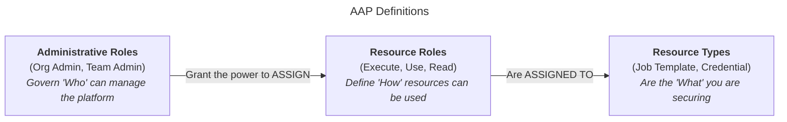
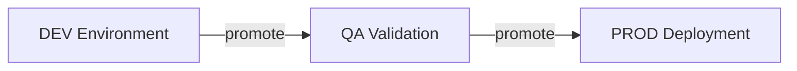
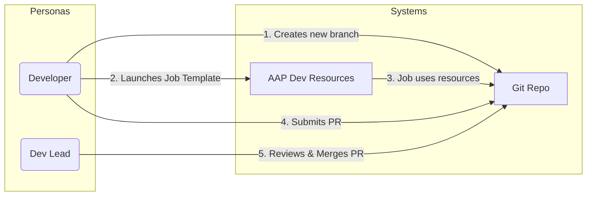
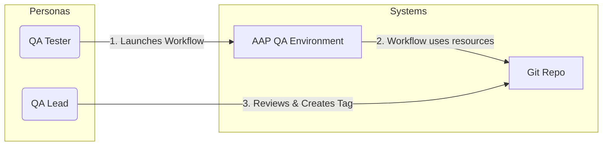
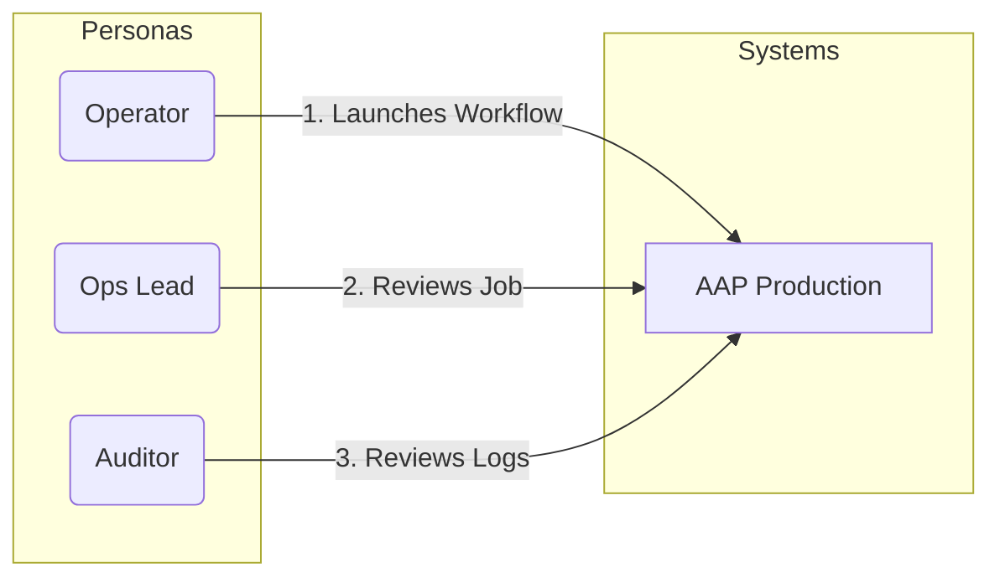
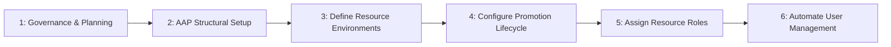

# Ansible Automation Platform (AAP) - Persona-Based RBAC Model

This document presents a comprehensive, persona-based model for implementing Role-Based Access Control (RBAC) in Ansible Automation Platform (AAP). It begins by defining key personas and their responsibilities, maps them to a formal governance matrix (RACI), and then provides a detailed implementation plan. The plan covers team structures, resource environments, a secure promotion lifecycle, and a reference appendix for all AAP-specific objects and roles.

## Table of Contents

* [About **YOUR** Team](#about-your-team)
  * [Personas - The Who](#personas)
  * [Team Model - Why](#team-model)
  * [Governance Matrix - RACI](#governance-matrix)
* [AAP Definitions](#aap-definitions)
  * [Administrative Roles](#aap-administrative-roles)
  * [Resource Roles](#aap-resource-roles)
  * [Resource Types](#aap-resource-types)
* [AAP Implementation](#aap-implementation)
  * [Organization and Teams](#organization-and-team-mapping)
  * [Resource Environment Mapping](#resource-environment-mapping)
  * [Automation Promotion Lifecycle - DEV QA PROD](#automation-promotion-lifecycle)
  * [Team Resource Role Mapping](#team-resource-role-mapping)
* [Milestones - **YOUR** Checklist](#milestones)
* [Appendix](#appendix)
  * [IdP Group Mapping](#aap-to-idp-group-mapping)

## About YOUR Team

This section is the core of the governance plan. It defines the people, the rules, and the responsibilities for your automation practice.

It's broken down into three key parts:

* [Personas - Who](#personas) identify all the key players (e.g., Platform Admin, Org Admin, Developer, Operator, QA Tester, Auditor) and organizes them by their area of responsibility and project team.  This table defines the key people and their generic roles *before* we map them to AAP.
* [Team Model - Why](#team-model) explains the critical security rules, such as Developers being unable to run automation in production, and defines the clear accountability for each high-level role.
* [Governance Matrix - What](#governance-matrix) details the RACI matrix that assigns responsibility (Responsible, Accountable, Consulted, Informed) for every major task in the automation lifecycle, from installing AAP to running a production job.

### Personas

| Area of Responsibility | Project Team | Persona | Generic Job Description |
| :--- | :--- | :--- | :--- |
| Platform Management | Platform Team | Platform Admin | Manages the company's central IT platforms. Responsible for uptime, security, and integration of enterprise-wide tools. |
| Organization Management | Org Governance Team | Org Admin | Governs a specific business unit. Accountable for all resources, data, and compliance within that unit. |
| Automation Lifecycle | AppDev Team | Team Lead | Leads a development team. Responsible for managing developers, assigning tasks, and overseeing the development lifecycle. |
| Automation Lifecycle | AppDev Team | Developer | Writes, tests, and maintains application code and automation scripts. Responsible for the functional quality of the software. |
| Automation Lifecycle | AppOps Team | Team Lead | Leads an operations team. Responsible for managing operators, ensuring service uptime, and coordinating production activities. |
| Automation Lifecycle | AppOps Team | Operator | Executes standard operating procedures (SOPs) in production. Responsible for running pre-approved tasks and monitoring systems. |
| Automation Lifecycle | QA Team | QA Lead | Leads the QA team. Responsible for test strategy and signing off on automation quality before production release. |
| Automation Lifecycle | QA Team | QA Tester | Executes tests on automation in a pre-production environment to validate functionality and safety. |
| Automation Lifecycle | Compliance Team | Team Lead | Leads a compliance team. Responsible for managing auditors and ensuring all processes meet regulatory requirements. |
| Automation Lifecycle | Compliance Team | Auditor | Reviews and verifies that all activities adhere to company policy and legal regulations. Responsible for generating audit reports. |

### Team Model

#### Clear Accountability

| Persona | Is Accountable For... |
| :--- | :--- |
| **Platform Admin** | The *platform* being online. |
| **Org Admin** | Everything that happens *inside* their organization. |
| **QA Lead** | The *quality and safety* of automation before it is approved for production. |
| **Audit Lead** | The *review* of what happened. |

#### Separation of Duties

| Persona | Key Responsibility (Separation of Duty) |
| :--- | :--- |
| **Developer** | Can *write* automation but **cannot run** in production or **see** production secrets. |
| **Tester** | Can *validate* automation in a safe QA environment, acting as a quality gate. |
| **Operator** | Can *run* approved automation but **cannot change** it or **see** production secrets. |
| **Team Leads** | Can *manage* their respective teams but **cannot** bypass the controls. |
| **Org Admin** | Can *manage* production secrets and hosts but does not write code or run daily operations. |

### Governance Matrix

**Table Key:**

* **R** = Responsible (Does the work)
* **A** = Accountable (Owns the outcome; must approve)
* **C** = Consulted (Provides input)
* **I** = Informed (Is kept in the loop)

| Task / Activity | Platform Admin | Org Admin | Dev Lead | Developer | Ops Lead | Operator | QA Lead | QA Tester | Audit Lead | Auditor |
| :--- | :---: | :---: | :---: | :---: | :---: | :---: | :---: | :---: | :---: | :---: |
| **Platform Management** | | | | | | | | | | |
| 1. Install, Upgrade, & Patch AAP | **R, A** | I | I | I | I | I | I | I | I | I |
| 2. Configure Authentication (SAML/LDAP) | **R, A** | C | I | I | I | I | I | I | I | I |
| 3. Create/Manage Organizations | **R, A** | I | I | I | I | I | I | I | I | I |
| **Organization Management** | | | | | | | | | | |
| 4. Create/Manage Teams | I | **R, A** | C | C | C | C | C | I | C | C |
| 5. Manage Production Secrets (Credentials) | I | **R, A** | I | I | I | I | I | I | I | I |
| 6. Manage Production Hosts (Inventories) | I | **R, A** | C | C | C | I | C | I | I | I |
| 7. Manage Automation Code (Projects) | I | **A** | **R** | **R** | C | I | C | I | I | I |
| **Automation Lifecycle** | | | | | | | | | | |
| 8. Develop & Edit Job Templates | I | **A** | **R** | **R** | C | C | C | I | I | I |
| 9. Validate Automation in QA | I | C | C | C | I | I | **A** | **R** | I | I |
| 10. Execute Production Automation (Run Job) | I | **A** | I | I | **R** | **R** | C | I | I | I |
| 11. Audit Job History & Activity | I | C | I | I | C | I | I | I | **A** | **R** |

## AAP Definitions

This section provides tables which reference the specific AAP objects and roles used in this plan. It is important to distinguish between the key concepts:

* [Administrative Roles](#aap-administrative-roles) are for *governance* and define who can manage the platform's structure (e.g., managing teams, users, and organizations).
* [Resource Roles](#aap-resource-roles) are for *execution* and define the "keys" (permissions like `Execute`, `Use`) that link a team to a resource.
* [Resource Types](#aap-resource-types) are the *assets* you are securing with Resource Roles (e.g., Job Templates, Credentials, Inventories, and Projects).

### AAP Administrative Roles

| AAP Roles | Scope | Description |
| :--- | :--- | :--- |
| System Administrator | Platform-Wide | "Superuser." Has full control over the *entire* platform (all settings, all Orgs). Assigned directly to a **User**. |
| Organization Administrator | Organization | "Org Superuser." Has full control *inside* one Organization. Can be assigned to a **User** or a **Team**. |
| Team Admin | Team | "Team Manager." Can manage *only* a specific team's membership and the roles assigned *to that team*. |
| Member | Org / Team | "Belongs To" key. Grants membership to an Organization or Team but provides no permissions on its own. |

### AAP Resource Roles

| AAP Resource Roles | Resource(s) | Description |
| :--- | :--- | :--- |
| Admin | Job Template, Inventory, Credential, Project | "Master Key." Grants full control to view, edit, run, and delete the resource. **Lets user see secrets in Credentials.** |
| Execute | Job Template, Workflow Template | "Run Key." Allows the user to launch the job or workflow. |
| Use | Credential, Inventory, Project | "Consume Key." Allows a job to *use* the resource at runtime. **Does *not* let the user see secrets or host lists.** |
| Update | Project, Inventory | "Sync Key." Allows the user to refresh the resource from its source (e.g., pull code from Git, sync hosts from a cloud). |
| Read | All | "View-Only Key." Allows the user to see the resource's settings but not run it, edit it, or see its secrets. |

### AAP Resource Types

| AAP Resource Types | Description |
| :--- | :--- |
| Project | A pointer to your automation code, usually a Git repository. |
| Inventory | The collection of hosts (servers, network devices) you want to run automation against. |
| Credential | A secure, encrypted object that stores secrets like SSH keys, API tokens, or passwords. |
| Job Template | A runnable "automation job" that combines a Project, Inventory, and Credential. |
| Workflow Template | A sequence of multiple Job Templates that run in a specific order. |
| Instance Group | A pool of execution nodes where automation jobs can run. |
| Notification Template | A hook for sending notifications (e.g., to Slack, PagerDuty) about job success or failure. |

## AAP Implementation

This section maps the governance model above to the specific objects and roles within Ansible Automation Platform.  Mappings include:

* [Organization and Team Mapping](#organization-and-team-mapping) maps our generic personas to the specific AAP structure. This model uses a single `Organization` (the top-level container) to hold multiple, function-based `Teams`. For this use case, our Organization is named `automation-services`. Other examples of Organizations could be `Finance Department` or `Global Network Operations` if strict data segregation were required.
* [Resource Environment Mapping](#resource-environment-mapping) defines the parallel sets of resources that are required to build a secure automation lifecycle. Each team (dev, qa, and prod) is restricted to its own environment.
* [Automation Promotion Lifecycle - DEV QA PROD](#automation-promotion-lifecycle) shows typical workflow from DEV to QA to PROD.
* [Team Resource Role Mapping](#team-resource-role-mapping) shows the specific "keys" (AAP Roles) each team holds for each set of "locks" (AAP Resources).

### Organization and Team Mapping

| AAP Organization | Persona |  AAP Team | AAP Administrative Role |
| :--- | :--- | :--- | :--- |
| `N/A (Platform-Wide)` | Platform Admin | `N/A` | **System Administrator** (Assigned to User) |
| `automation-services` | Org Admin | `admins` | **Organization Administrator** (Granted to Team) |
| `automation-services` | Team Lead | `developers` | **Team Admin** (Granted to User, on this Team) |
| `automation-services` | Developer | `developers` | **Member** |
| `automation-services` | Team Lead | `operators` | **Team Admin** (Granted to User, on this Team) |
| `automation-services` | Operator | `operators` | **Member** |
| `automation-services` | QA Lead | `testers` | **Team Admin** (Granted to User, on this Team) |
| `automation-services` | QA Tester | `testers` | **Member** |
| `automation-services` | Team Lead | `auditors` | **Team Admin** (Granted to User, on this Team) |
| `automation-services` | Auditor | `auditors` | **Member** |

### Resource Environment Mapping

| Env| Template | Inventory | Credential | Project (Shared) | SCM Branch (Set on Job Template) |
| :--- | :--- | :--- | :--- | :--- | :--- |
| DEV | `dev-job` | `dev-hosts` | `dev-ssh-key` | `org-project` | Prompt on Launch - `feature/JIRA-123`|
| QA | `qa-workflow` | `qa-hosts` | `qa-ssh-key` | `org-project` | Locked - `main`|
| PROD | `prod-workflow` | `prod-hosts` | `prod-ssh-key` | `org-project` | Locked - `tags/v1.2.0`|

### Automation Promotion Lifecycle

This process is a basic example that shows how the personas and resources work together to move automation safely from development to production. The three tables below show the distinct paths for each environment.

#### DEV Environment

| Persona | Systems | Action | Resources |
| :--- | :--- | :--- | :--- |
| **Developer** | Git Repo | Creates new branch | `feature/JIRA-123` |
| **Developer** | AAP Dev Resources | Launches Job Template | `dev-job` |
| **Developer** | AAP Dev Resources | (Job) **Uses** Project (at branch) | `org-project` (pulls `feature/JIRA-123`) |
| **Developer** | AAP Dev Resources | (Job) **Uses** Inventory | `dev-hosts` |
| **Developer** | AAP Dev Resources | (Job) **Uses** Credential | `dev-ssh-key` |
| **Developer** | Git Repo | Submits PR | `feature/JIRA-123` -> `main` |
| **Dev Lead** | Git Repo | Reviews & Merges PR | `main` branch |

#### QA Validation

| Persona | Systems | Action | Resources |
| :--- | :--- | :--- | :--- |
| **QA Tester** | AAP QA Resources | Receives Notification | `main` branch |
| **QA Tester** | AAP QA Resources | **Launches** Workflow | `qa-workflow` |
| **QA Tester** | AAP QA Resources | (Workflow) **Uses** Project (locked) | `org-project` (pulls `main`) |
| **QA Tester** | AAP QA Resources | (Workflow) **Uses** Inventory | `qa-hosts` |
| **QA Tester** | AAP QA Resources | (Workflow) **Uses** Credential | `qa-ssh-key` |
| **QA Lead** | Git Repo | Reviews & Creates Tag | `tags/v1.2.0` |

#### PROD Deploy

| Persona | System | Action | Resources |
| :--- | :--- | :--- | :--- |
| **Operator** | AAP PROD Resources | Receives Notification | `tags/v1.2.0` |
| **Operator** | AAP PROD Resources | **Launches** Workflow | `prod-workflow` |
| **Operator** | AAP PROD Resources | (Workflow) **Uses** Project (locked) | `org-project` (pulls `tags/v1.2.0`) |
| **Operator** | AAP PROD Resources | (Workflow) **Uses** Inventory | `prod-hosts` |
| **Operator** | AAP PROD Resources | (Workflow) **Uses** Credential | `prod-ssh-key` |
| **Ops Lead** | AAP PROD Resources | Reviews Job | `prod-workflow` (Job Output) |
| **Auditor** | AAP DEV QA and PROD Resources | Reviews Job Logs at will | Job History |

> Note: Many of the "Notify" steps in this process can and should be automated (e.g., via webhooks from Git to a chat client, or with notification templates in AAP). They are shown here as manual steps for clarity.

### Team Resource Role Mapping

| AAP Team | Resource(s) | AAP Role Granted | Purpose (Separation of Duty) |
| :--- | :--- | :--- | :--- |
| `admins` | `prod-hosts` `prod-ssh-key` | **`Admin`** | Manages production secrets and hosts. Does *not* run or write automation. |
| `developers` | `dev-job` `dev-hosts` `dev-ssh-key` `org-project` | **`Admin`** **`Admin`** **`Admin`** **`Update`** | Full control over the *Development* environment to write and test code. Can *sync* the project. **No access** to QA or Prod. |
| `testers` | `qa-workflow` (and all Job Templates inside) `qa-hosts` `qa-ssh-key` | **`Execute`** **`Execute`** **`Use`** **`Use`** | Can *run* automation in the *QA* environment to validate it. **No access** to Dev or Prod. |
| `operators` | `prod-workflow` (and all Job Templates inside) `prod-hosts` `prod-ssh-key` | **`Execute`** **`Execute`** **`Use`** **`Use`** |  Can *run* approved automation in *Production*. **Cannot see secrets** or **change the code**. |
| `auditors` | `All Resources` (Templates, Inventories, etc.) | **`Read`** |  Can *see* everything (e.g., job history, settings) but **cannot run** jobs or **see secrets**. |

**Note on Workflow Permissions:** For the `QA Testers` and `Operators` to successfully run their `Workflow Template`, their team must be granted `Execute` on the workflow *and* `Execute` on all Job Templates *inside* that workflow.

## Milestones

Here are the descriptions for each bullet item, summarizing the goal of each milestone:

| Milestone # | Milestone Name | Description |
| :--- | :--- | :--- |
| 1 | Governance & Planning (The "Who & Why") | Define the people (**Personas**) and their responsibilities (**RACI**) before configuring any technology. This ensures the technical build aligns with your business and security requirements. |
| 2 | AAP Structural Setup (The "Where") | Create the foundational containers in AAP. This includes the main **Organization** to hold all assets and the specific **Teams** (like `developers` or `operators`) that your personas will belong to. |
| 3 | Define Resource Environments (The "What") | Build the parallel sets of automation resources (**Inventories**, **Credentials**, etc.) that make up your DEV, QA, and PROD environments. This isolates production from development. |
| 4 | Configure the Promotion Lifecycle | Create the **Job** and **Workflow Templates** for each environment. This step locks down the SCM branches (like `main` or `tags`) to ensure only approved code runs in QA and PROD. |
| 5 | Assign Resource Roles (The "How") | This is the most critical step for security. Apply the "keys" (**Resource Roles** like `Execute` or `Use`) to each **Team**. This enforces the separation of duties, such as allowing Operators to *run* jobs but not *change* them. |
| 6 | Automate User Management | Integrate AAP with your corporate Identity Provider (IdP). This allows you to automatically add users to the correct AAP Teams (and grant them the right permissions) based on their existing enterprise group membership (like an Active Directory group). |

### Milestone 1: Governance & Planning (The 'Who & Why')

* [ ] Identify all user Personas (Developer, Operator, Auditor, etc.)
* [ ] Define responsibilities with a RACI Matrix and get buy-in from stakeholders.

### Milestone 2: AAP Structural Setup (The 'Where')

* [ ] Create the primary Organization (e.g., automation-services).
* [ ] Create the functional Teams (e.g., developers, operators, testers, admins, auditors).
* [ ] Assign Administrative Roles (e.g., Organization Administrator to the admins team, Team Admin to the Team Leads).

### Milestone 3: Define Resource Environments (The 'What')

* [ ] Create one shared Project (e.g., org-project) pointing to your Git repository.
* [ ] Create parallel Credentials for each environment (e.g., dev-ssh-key, qa-ssh-key, prod-ssh-key).
* [ ] Create parallel Inventories for each environment (e.g., dev-hosts, qa-hosts, prod-hosts).

### Milestone 4: Configure the Promotion Lifecycle

* [ ] Create the Job/Workflow Templates for each environment (e.g., dev-job, qa-workflow, prod-workflow).
* [ ] Configure the SCM branch on each template (Prompt for Dev, main for QA, tags for Prod).

### Milestone 5: Assign Resource Roles (The 'How')

* [ ] Grant Resource Roles to each Team as defined in the "Team Resource Role Mapping" table.
* [ ] (e.g., Grant Execute on prod-workflow and Use on prod-hosts to the operators team).
* [ ] (e.g., Grant Admin on dev-job and Update on org-project to the developers team).

### Milestone 6: Automate User Management

* [ ] *Most likely this is an earlier phase*
* [ ] Integrate AAP with your external IdP (Active Directory, SAML, etc.).
* [ ] Create the IdP Group Mappings to link your IdP groups (e.g., AD-Automation-Operators) to your AAP teams (e.g., operators).

## Appendix

### AAP to IdP Group Mapping

This "IdP Group Mapping" shows how to automate team membership by mapping your AAP Teams to your company's external Identity Provider (IdP) groups, such as Active Directory (AD).

| AAP Organization | AAP Team | Mapped IdP Group (e.g., from Active Directory) | Purpose (Who gets added) |
| :--- | :--- | :--- | :--- |
| `N/A` | `N/A` | `AD-AAP-Platform-Admins` | **Platform Admins** Grants **System Administrator** role directly to users in this group. |
| `automation-services` | `admins` | `AD-Automation-Org-Admins` | **Org Admins** Grants **Organization Administrator** role to this team. |
| `automation-services` | `developers` | `AD-Automation-Developers` | **Developers** Gets **Admin** on Dev resources and **Update** on Projects. |
| `automation-services` | `testers` | `AD-Automation-testers` | **QA Team** Gets **Execute** on QA Workflows. |
| `automation-services` | `operators` | `AD-Automation-operators` | **Operators** Gets **Execute** on Prod Workflows. |
| `automation-services` | `auditors` | `AD-Compliance-Team` | **Auditors** Gets **Read** access on all resources for auditing. |