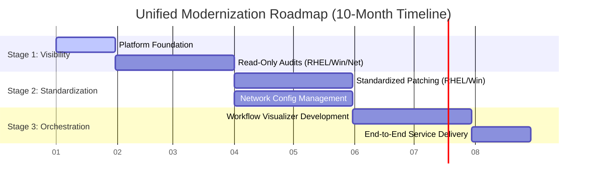

# Strategic Roadmap: Unified Infrastructure Modernization

**Document:** 00_Executive_Summary.md  
**Status:** v1.0  
**Target:** Unified Cross-Platform Automation (RHEL, Windows, Network)

---

## 1. The Mission

To transition from manual, independent administration to a **Unified Automation Fabric**. This strategy consolidates institutional knowledge into a shared codebase, reducing technical debt and streamlining operations for a multi-tasking, cross-functional team.

## 2. Core Objectives

* **Centralize Knowledge:** Consolidate "how-to" logic into a shared, version-controlled Git library to ensure cross-platform consistency.
* **Streamline Operations:** Automate high-frequency maintenance (Patching, Backups, Compliance) across Linux, Windows, and Network assets.
* **Secure the Mission:** Establish AAP and Satellite as the **Policy Enforcement Points** for a transparent, auditable, and resilient environment.

## 3. High-Level Milestone Roadmap

### Phases

| Phase | Milestone | OUTPUT |OUTCOME |
| :--- | :--- | :--- | :--- |
| **Stage 1** | **Foundational Visibility** | Read-only audits & Shared Git Repository. | **Risk Reduction:** Unified visibility and assessment across all domains. |
| **Stage 2** | **Standardized Operations** | Active patching & shared configuration roles. | **Efficiency:** Recovery of hours spent on repetitive day-to-day tasks. |
| **Stage 3** | **Service Orchestration** | Multi-tier **AAP Workflow Visualizer** logic. | **Agility:** End-to-end service delivery and rapid mission response. |

### Time Line

### **Roadmap Timeline & Execution Phases**

#### **Stage 1: Foundational Visibility (Months 1–3)**

* **Weeks 1–4:** **Platform Foundation** – Deployment of AAP Controller and Private Automation Hub. Establishing the Unified Git Repository.
* **Weeks 5–12:** **Operational Insights** – Creation of "Read-Only" assessment playbooks. Developing cross-platform health-check reports for RHEL, Windows, and Network assets.

#### **Stage 2: Standardized Operations (Months 4–7)**

* **Weeks 13–20:** **Maintenance Automation** – Implementation of automated patching cycles and configuration drift detection for RHEL and Windows.
* **Weeks 21–28:** **Unified Governance** – Deployment of "Shared Global Roles." Establishing consistent security baselines (e.g., NTP, DNS, and SSH) across all environments.

#### **Stage 3: Service Orchestration (Months 8–10)**

* **Weeks 29–36:** **Workflow Integration** – Chaining cross-functional tasks using the **AAP Workflow Visualizer** to create end-to-end service delivery.
* **Weeks 37–40:** **ROI Validation** – Finalizing the Automation Dashboard. Documenting time-savings and mission-readiness metrics to validate operational evolution.

## 4. Operational ROI Framework

* **Administrative Reclaim:** Significant hours recovered from manual patching and compliance auditing, allowing the team to focus on higher-tier mission priorities.
* **Audit Readiness:** A 100% auditable trail of "Who, What, Where, and When" for every change made across the enclave.
* **Operational Continuity:** Automation acts as "institutional memory," ensuring mission stability and knowledge retention regardless of organizational changes.

---
*Note: This roadmap is a strategic guide for platform adoption and operational evolution.*

