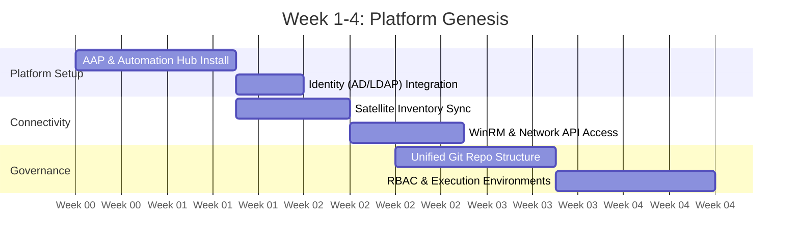

# Platform Foundation: Establishing the Unified Environment

**Document:** 01_Platform_Foundation.md  
**Timeline:** Weeks 1–4  
**Primary Focus:** Centralized Infrastructure & Governance

---

## **Visual Timeline: The First 30 Days**

## 1. Objective

To deploy a resilient, enterprise-grade automation platform that serves as the "Common Language" for all administrative teams. The goal is to move from local, individual scripts to a centralized, audited system of record.

## 2. Core Infrastructure Components

The following components form the backbone of the modernization effort:

* **AAP Controller:** The centralized engine for executing automation, managing credentials, and providing role-based access control (RBAC).
* **Private Automation Hub:** The internal "Storefront" for certified content, roles, and execution environments.
* **Red Hat Satellite:** The authoritative source for RHEL content curation, patch management, and system health data.
* **Version Control (Git):** The definitive library where all cross-functional automation logic is stored, reviewed, and versioned.

## 3. Implementation Milestones (Weeks 1–4)

### Week 1: Platform Deployment

* Install AAP Controller and Private Automation Hub in the designated enclave.
* Integrate with existing Identity Providers (AD/LDAP) to ensure team members use existing credentials.

### Week 2: Content & Inventory Connectivity

* Configure **Red Hat Satellite** as a Dynamic Inventory source.
* Establish connectivity to Windows endpoints (WinRM/SSH) and Network appliances (API/SSH).

### Week 3: The Unified Repository Structure

* Establish the primary Git repository for the team.
* **Structure Strategy:** * `/org_roles`: Shared logic used by everyone (e.g., security hardening).
  * `/rhel`: Linux-specific playbooks.
  * `/windows`: Windows-specific playbooks.
  * `/network`: Network-specific playbooks.

### Week 4: Access & Governance

* Define "Teams" within the AAP Controller (e.g., Network_Admins, Windows_Admins).
* Set up initial **Execution Environments** to ensure every admin is running the same version of Ansible and its dependencies.

## 4. Operational Handshake

During this phase, the **Lead** ensures that the "Source of Truth" (Satellite) is successfully feeding data into the **Execution Engine** (AAP). This connection ensures that automation is always acting on the most current state of the infrastructure.

---
