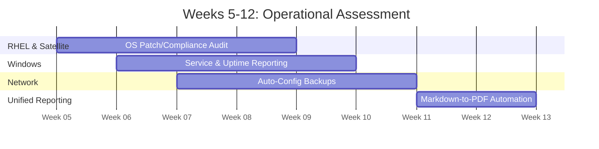

# Stage 1: Foundational Visibility

**Document:** 02_Stage_1_Foundational_Visibility.md  
**Timeline:** Weeks 5–12 (Months 2–3)  
**Primary Focus:** Cross-Platform Insights & Risk-Free Assessment

## **Visual Timeline: Gaining Operational Insight**

---

## 1. Objective
To demonstrate the power of the platform by generating real-world operational data. By focusing on **"Read-Only"** tasks, the team builds trust in the automation engine while providing the Lead with unprecedented visibility into the environment without the risk of system changes.

## 2. The "Read-Only" Strategy
The goal is to answer the fundamental question: *"What is the current state of our infrastructure?"* This phase validates connectivity across all domains (RHEL, Windows, Network) while producing immediate, actionable reports.

## 3. Cross-Functional Milestones (Weeks 5–12)

### RHEL: Compliance & Patch Assessment
* **Task:** Use AAP to trigger **Red Hat Satellite** scans and query errata status.
* **Output:** A unified report of every RHEL host, current kernel versions, and missing security patches.
* **Value:** Replaces manual check-calls with a push-button compliance overview.

### Windows: Health & Availability Audit
* **Task:** Query the status of core Windows services (e.g., Print Spooler, Windows Update, or custom mission-app services).
* **Output:** A "Traffic Light" report showing servers with stopped services or pending reboot flags.
* **Value:** Identifies potential failures before they result in mission downtime.

### Network: Automated Configuration Archival
* **Task:** Connect to switches/routers and pull the "running-config."
* **Output:** Automatically commit these configurations to the **Shared Git Library** with a precise timestamp.
* **Value:** Creates a reliable historical record and a "last known good" archive.

## 4. The ROI Deliverable: Unified Reporting
In the final weeks of this stage, the team will implement a "Report Aggregator" playbook. This gathers the disparate data from all audits into a single **Markdown** file and converts it into a professional **PDF** for leadership.

* **Outcome:** The Lead receives a weekly "State of the Enclave" briefing generated entirely by automation, proving the value of the platform in under 90 days.

