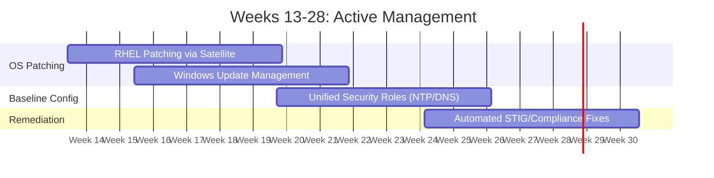

# Stage 2: Standardized Operations

**Document:** 03_Stage_2_Standardized_Operations.md  
**Timeline:** Weeks 13–28 (Months 4–7)  
**Primary Focus:** Active Maintenance & Automated Compliance

---

## 1. Objective

To reclaim administrative time by automating high-frequency maintenance and "Day 2" operations. This stage moves beyond observation into active management, ensuring consistency and eliminating configuration drift across the environment.

## 2. Transitioning to Active Automation

In this phase, the team leverages the trust and connectivity established in Stage 1 to perform "Write" actions. The focus is on standardized, low-risk tasks that provide the highest return on reclaimed time.

## 3. Cross-Functional Milestones (Weeks 13–28)

### Unified Patching Operations

* **RHEL:** Integrate AAP with **Red Hat Satellite** to automate Content View promotion and remote patching execution.
* **Windows:** Utilize the `win_updates` module for managed update cycles, including automated reboots and post-patch health verification.
* **Value:** Monthly maintenance windows are reduced from weekend-long manual efforts to supervised, push-button executions.

### The "Global Role" Initiative

Establish shared logic within the `/org_roles` directory to enforce common standards:

* **Infrastructure Baseline:** Ensure NTP, DNS, and logging (Syslog/Event Log) configurations are identical across every server and switch.
* **Value:** Updates to core infrastructure (like a new DNS IP) are pushed to the entire enclave instantly from a single variable.

### Automated Compliance Remediation

* **Task:** Move from reporting STIG violations to automated remediation.
* **Action:** Deploy Ansible roles to automatically bring non-compliant systems back into alignment.
* **Value:** Ensures the enclave remains in a "continuously compliant" state between official audits.

## 4. Operational Gains

By the end of Stage 2, the team has established an **Automated Standard Operating Environment (SOE)**.

* **Institutional Memory:** Correct configurations are defined as code in Git, not stored in individual silos.
* **Efficiency:** Troubleshooting time is significantly reduced because all systems are enforced to a known, identical standard.
