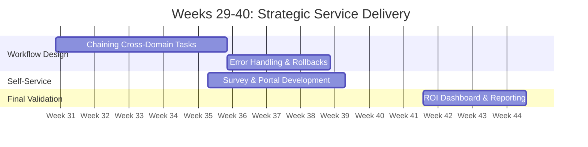

# Stage 3: Service Orchestration

**Document:** 04_Stage_3_Service_Orchestration.md  
**Timeline:** Weeks 29–40 (Months 8–10)  
**Primary Focus:** Cross-Functional Workflows & High-Value Service Delivery

---

## 1. Objective

To move beyond independent task execution and into full-service orchestration. By using the **AAP Workflow Visualizer**, the team will link disparate tasks into complex, multi-tier processes that accelerate mission delivery and eliminate the need for manual cross-team coordination.

## 2. The Power of the Workflow Visualizer

At this stage, the team no longer executes "a playbook." They initiate "a service." The Visualizer allows for sophisticated conditional logic, such as "If the Network change succeeds, proceed to Windows patching; if it fails, trigger an automated rollback."

## 3. Strategic Milestones (Weeks 29–40)

### End-to-End Mission Workflows

The team will collaborate on "Big Win" workflows that bridge all administrative domains:

* **Integrated Maintenance Mode:** 1. **Network:** Redirects traffic at the load balancer or switch level.
    2. **RHEL/Windows:** Executes patching and verified reboots.
    3. **Network:** Restores traffic flow and verifies application health.
* **Value:** A complex process that once required multiple admins on a bridge call is now a single, audited button press.

### Self-Service & Empowerment

* **Task:** Develop **Surveys** in the AAP Controller for common requests.
* **Action:** Create a "New Environment" survey where an admin enters a hostname and IP, and AAP handles the VLAN tagging (Network), OS provisioning (RHEL/Satellite), and domain join (Windows).
* **Value:** Reduces "gatekeeping" of routine tasks, allowing senior admins to focus on architecture.

### Advanced Error Handling

* **Task:** Implement automated rollbacks.
* **Action:** If a configuration change results in a loss of connectivity or service failure, the workflow automatically reverts to the "Last Known Good" configuration archived during Stage 1.

## 4. The Final ROI: Proving the Mission

The final weeks are dedicated to the **Automation Dashboard** to provide data-driven validation:

* **Total Executions:** Quantifying the thousands of manual steps handled by the platform.
* **Consistency Score:** Verification of 0% drift from established security baselines.
* **Time Recovery:** A final summary of hundreds of hours reclaimed for the team to focus on mission-critical modernization.
