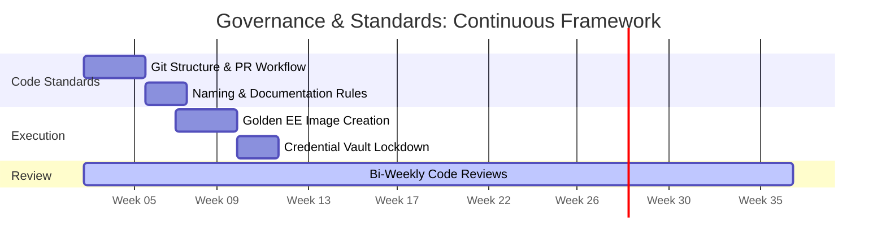

# Governance and Standards: The Unified Framework

**Document:** 05_Governance_and_Standards.md  
**Timeline:** Continuous (Starting Week 3)  
**Primary Focus:** Consistency, Code Quality, and Knowledge Sharing

---

## 1. Objective
To establish the "Rules of the Road" for the automation team. This document ensures that regardless of which admin writes a playbook (RHEL, Windows, or Network), the code is maintainable, secure, and follows a consistent structure.

## 2. Shared Code Architecture
To prevent the recreation of "manual silos" in digital form, all automation must follow the Unified Repository Structure established in the Foundation phase.

### Git Branching Strategy
* **Main Branch:** The "Production" branch. Only tested, verified code is merged here.
* **Development Branches:** Where admins build and test new features (e.g., `feature/windows-patching`).
* **Pull Requests (PRs):** All code must be reviewed by at least one other team member before merging. This facilitates cross-training between RHEL and Windows admins.

## 3. Playbook & Role Standards

### Naming Conventions
* **Playbooks:** Use descriptive, action-oriented names (e.g., `audit_network_snmp.yml`, `remediate_rhel_stig.yml`).
* **Variables:** Must be prefixed with the role name to avoid conflicts (e.g., `win_patch_reboot_timeout`).

### Documentation Requirements
Every playbook must include a header block containing:
* **Description:** What the automation does.
* **Assumptions:** What must be true for it to run (e.g., "Requires WinRM access").
* **Inputs/Outputs:** What variables are needed and what report is produced.

## 4. Execution Environments (EE)
To ensure "it works on my machine" is never an issue:
* All automation must run within a **Standard Execution Environment** hosted on the Private Automation Hub.
* The Lead will approve the "Golden EE" image which contains the specific versions of Python, Ansible, and Collections required for the enclave.

## 5. Secret Management
* **Zero Hardcoded Passwords:** No credentials shall ever be stored in the Git repository.
* **AAP Vault:** All sensitive data (SSH keys, Service Account passwords) must be stored in the AAP Controller’s encrypted credential store.

---

## 6. Continuous Evolution
This document is a living framework. As the team moves through Stages 1, 2, and 3, these standards will be updated to reflect new lessons learned and emerging mission requirements.